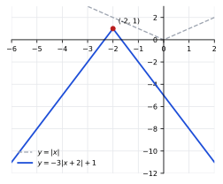
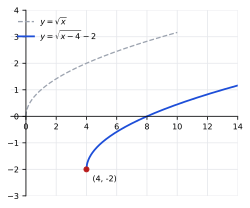
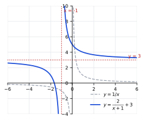
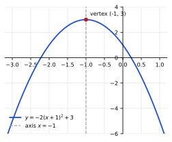
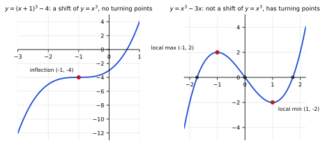

# Homework 2 Solutions

Based on [Lecture 2: Functions, Graphs, and Transformations](../Notes/N2.md).

**Exercise 1.** Find the domain and range of
$f(x)=\dfrac{\sqrt{x-1}}{x-3}$.

**Domain.** The square root requires $x-1\ge0$, i.e. $x\ge1$, and the
denominator requires $x\neq3$. So the domain is

$$
\boxed{[1,3)\cup(3,\infty)}.
$$

**Range.** Substitute $t=\sqrt{x-1}\ge0$, so $x=t^2+1$ and
$x-3=t^2-2$. Then

$$
f=\frac{t}{t^2-2}=:h(t),\qquad t\ge0,\ t\neq\sqrt2.
$$

**$h$ is strictly decreasing on each of $[0,\sqrt2)$ and $(\sqrt2,\infty)$.**
Take any $t_1,t_2$ with $0\le t_1<t_2$ lying in the *same* one of these two
intervals. Then

$$
\begin{aligned}
h(t_1)-h(t_2)
&=\frac{t_1}{t_1^2-2}-\frac{t_2}{t_2^2-2}
=\frac{t_1(t_2^2-2)-t_2(t_1^2-2)}{(t_1^2-2)(t_2^2-2)} \\
&=\frac{t_1t_2^2-t_2t_1^2-2t_1+2t_2}{(t_1^2-2)(t_2^2-2)}
=\frac{t_1t_2(t_2-t_1)+2(t_2-t_1)}{(t_1^2-2)(t_2^2-2)} \\
&=\frac{(t_2-t_1)(t_1t_2+2)}{(t_1^2-2)(t_2^2-2)}.
\end{aligned}
$$

The numerator is positive: $t_2-t_1>0$ by assumption, and $t_1t_2+2>0$
since $t_1,t_2\ge0$. For the denominator, both $t_1,t_2$ lie in the same
interval, so either $t_1^2-2<0$ and $t_2^2-2<0$ (both less than $\sqrt2$),
or $t_1^2-2>0$ and $t_2^2-2>0$ (both greater than $\sqrt2$); either way the
product $(t_1^2-2)(t_2^2-2)>0$. So $h(t_1)-h(t_2)>0$, i.e. $h(t_1)>h(t_2)$,
proving $h$ is strictly decreasing on each branch.

* On $[0,\sqrt2)$: $h(0)=0$, and as $t\to\sqrt2^-$ the denominator
 $t^2-2\to0^-$ with numerator positive, so $h(t)\to-\infty$. Since $h$ is
 an unbroken, strictly decreasing curve from $0$ down to $-\infty$, it
 takes every value in $(-\infty,0]$.
* On $(\sqrt2,\infty)$: as $t\to\sqrt2^+$ the denominator $\to0^+$, so
 $h(t)\to+\infty$; as $t\to\infty$, $h(t)\to0^+$ but never reaches $0$.
 Since $h$ is an unbroken, strictly decreasing curve from $+\infty$ toward
 (but not including) $0$, it takes every value in $(0,\infty)$.

The two branches together cover $(-\infty,0]\cup(0,\infty)$, so

$$
\boxed{\text{range}=(-\infty,\infty)}.
$$

(Every real number, positive, negative, or zero, is attained: for
example $f(4)=1$, $f\!\left(\tfrac{9}{4}\right)=\tfrac12/(-\tfrac34)=-\tfrac23$,
and pushing $x$ close to $3$ from either side sends $f(x)$ to $\pm\infty$.)

**Exercise 2.** True or false, with a reason:

* the range of $y=x^2$ is all real numbers
* the graph of $y=1/x$ crosses the $y$-axis
* $y=\sqrt{x}$ is the top half of $y=x^2$ turned on its side
* $y=x^3$ has domain restricted to $x\ge0$
* $|x|$ and $x^2$ have the same range

* **False.** Squares are never negative, so the range of $y=x^2$ is
 $[0,\infty)$, not all of $\mathbb R$.
* **False.** The $y$-axis is $x=0$, which is excluded from the domain of
 $y=1/x$, so the graph never meets it.
* **True.** Turning the sideways parabola $x=y^2$ (equivalently $y^2=x$) on
 its side and keeping only the upper half $y\ge0$ gives exactly
 $y=\sqrt{x}$, since solving $x=y^2$ for $y\ge0$ yields $y=\sqrt{x}$.
* **False.** $y=x^3$ is defined, and one-to-one, for every real $x$; its
 domain is $(-\infty,\infty)$.
* **True.** Both $|x|$ and $x^2$ take every nonnegative value and no
 negative value, so both have range $[0,\infty)$.

**Exercise 3.** Decide whether each is a function of $x$, and whether it is
even, odd, or neither:

* $y=3x-2$
* $x=y^2+1$
* $y=x^4$
* $y=x^3+x^2$

* $y=3x-2$: this is a function of $x$ (one output per input). Let
 $f(x)=3x-2$. Then $f(-x)=-3x-2$. This equals neither $f(x)=3x-2$ nor
 $-f(x)=-3x+2$, so $f$ is **neither** even nor odd.
* $x=y^2+1$: solving for $y$ gives $y=\pm\sqrt{x-1}$, two values of $y$ for
 each $x>1$, so this is **not a function of $x$**.
* $y=x^4$: this is a function of $x$. Let $f(x)=x^4$. Then
 $f(-x)=(-x)^4=x^4=f(x)$, so $f$ is **even**.
* $y=x^3+x^2$: this is a function of $x$. Let $f(x)=x^3+x^2$. Then
 $f(-x)=-x^3+x^2$. This is not equal to $f(x)=x^3+x^2$ (so not even), and
 not equal to $-f(x)=-x^3-x^2$ (so not odd, since the $x^2$ terms have
 opposite signs). Thus $f$ is **neither**.

**Exercise 4 (harder).** Find the domain and range of
$g(x)=\dfrac{1}{\sqrt{x^2-4}}$.

**Domain.** The expression under the square root must be positive (it
cannot be zero, since it sits in a denominator), so $x^2-4>0$, i.e.
$x^2>4$. Thus

$$
\boxed{(-\infty,-2)\cup(2,\infty)}.
$$

**Range.** Let $u=x^2-4$. As $x$ ranges over the domain, $u$ ranges over
$(0,\infty)$: as $|x|\to2^+$, $u\to0^+$, and as $|x|\to\infty$,
$u\to\infty$, with $u$ taking every value in between by continuity. Then
$\sqrt u$ ranges over $(0,\infty)$ as well, and so does its reciprocal
$1/\sqrt u$ (the reciprocal of a positive number can be made arbitrarily
large by taking $u$ near $0$, or arbitrarily close to $0$ by taking $u$
large, and every intermediate positive value is attained by continuity).
Hence

$$
\boxed{(0,\infty)}.
$$

**Exercise 5.** Describe the transformations from the parent function in
each, then sketch the resulting graph:

* $y=-3|x+2|+1$
* $y=\sqrt{x-4}-2$
* $y=\dfrac{2}{x+1}+3$

**(a) $y=-3|x+2|+1$.** Starting from $y=|x|$: shift left $2$ (giving
$|x+2|$), scale vertically by $3$ (steeper slopes, $\pm3$), reflect across
the $x$-axis (the negative sign, so the graph opens downward), then shift
up $1$. The vertex moves from $(0,0)$ to $(-2,1)$.

{width=300px}

**(b) $y=\sqrt{x-4}-2$.** Starting from $y=\sqrt{x}$: shift right $4$
(giving $\sqrt{x-4}$, domain $x\ge4$), then shift down $2$. The starting
point moves from $(0,0)$ to $(4,-2)$.

{width=300px}

**(c) $y=\dfrac{2}{x+1}+3$.** Starting from $y=1/x$: shift left $1$
(vertical asymptote moves from $x=0$ to $x=-1$), scale vertically by $2$,
then shift up $3$ (horizontal asymptote moves from $y=0$ to $y=3$).

{width=300px}

**Exercise 6.** If $(2,-1)$ is on the graph of $f$, find the corresponding
point on $y=f(x)+4$, on $y=f(x-3)$, and on $y=-f(-x)$.

Since $(2,-1)$ is on $y=f(x)$, we have $f(2)=-1$.

* $y=f(x)+4$: from the transformation table, $f(x)+k$ sends $(a,b)$ to
 $(a,b+k)$. With $a=2,b=-1,k=4$, the point is $\boxed{(2,3)}$.
* $y=f(x-3)$: $f(x-h)$ sends $(a,b)$ to $(a+h,b)$. With $h=3$, the point is
 $\boxed{(5,-1)}$.
* $y=-f(-x)$: reflect across the $y$-axis first ($f(-x)$ sends $(a,b)$ to
 $(-a,b)$), then reflect across the $x$-axis ($-f(x)$ sends $(a,b)$ to
 $(a,-b)$). Applying both to $(2,-1)$: first to $(-2,-1)$, then to
 $(-2,1)$. Directly: if $x=-2$ then $-x=2$, $f(-x)=f(2)=-1$, so
 $-f(-x)=1$. The point is $\boxed{(-2,1)}$.

**Exercise 7.** Find the line through $(-1,4)$ and $(3,-8)$.

The slope is

$$
m=\frac{-8-4}{3-(-1)}=\frac{-12}{4}=-3.
$$

Using point-slope form through $(-1,4)$,

$$
y-4=-3(x+1),
$$

so

$$
\boxed{y=-3x+1}.
$$

**Exercise 8.** Sketch $y=-2(x+1)^2+3$, then state its vertex, axis,
opening direction, and range.

Comparing with $a(x-h)^2+k$: since $x+1=x-(-1)$, we read off $a=-2$,
$h=-1$, $k=3$. Therefore:

* Vertex: $\boxed{(-1,3)}$
* Axis: $\boxed{x=-1}$
* Opening direction: since $a=-2<0$, the parabola opens
 $\boxed{\text{downward}}$
* Range: the vertex is a maximum, so $\boxed{(-\infty,3]}$

{width=300px}

**Exercise 9.** Rewrite $y=3x^2-12x+7$ in vertex form.

Here $a=3$, $b=-12$, $c=7$, so

$$
h=-\frac{b}{2a}=-\frac{-12}{2(3)}=2,\qquad
k=c-\frac{b^2}{4a}=7-\frac{(-12)^2}{4(3)}=7-\frac{144}{12}=7-12=-5.
$$

Therefore

$$
\boxed{y=3(x-2)^2-5}.
$$

Check by expanding: $3(x-2)^2-5=3(x^2-4x+4)-5=3x^2-12x+12-5=3x^2-12x+7$,
which matches the original.

**Exercise 10.** Is $y=(x+1)^3-4$ a transformation of $y=x^3$? Is
$y=x^3-3x$? Explain.

**$y=(x+1)^3-4$:** Yes. This has the form $a(x-h)^3+k$ with $a=1$,
$h=-1$, $k=-4$ (since $x+1=x-(-1)$), which is $y=x^3$ shifted left $1$ and
down $4$. As a shift of $x^3$, it is strictly increasing everywhere and has
no turning points.

**$y=x^3-3x$:** No. Factor it as $x^3-3x=x(x^2-3)=x(x-\sqrt3)(x+\sqrt3)$,
which has three distinct real zeros: $-\sqrt3$, $0$, $\sqrt3$. A pure shift
$a(x-h)^3+k$ of $y=x^3$ is strictly monotonic (since $x^3$ is strictly
increasing, or strictly decreasing if $a<0$), so it can cross zero **at
most once** — it cannot have three separate real zeros. Since $x^3-3x$ has
three real zeros, it cannot be written in the form $a(x-h)^3+k$, so it is
not a transformation of $y=x^3$; between consecutive zeros the graph must
turn around, giving it two turning points that no shift of $x^3$ can
produce.

{width=420px}

**Exercise 11.** Let $f(x)=x^2+1$ and $g(x)=2x-3$. Find
$(f\circ g)(x)$ and $(g\circ f)(x)$.

$$
(f\circ g)(x)=f(g(x))=f(2x-3)=(2x-3)^2+1=4x^2-12x+9+1=\boxed{4x^2-12x+10}.
$$

$$
(g\circ f)(x)=g(f(x))=g(x^2+1)=2(x^2+1)-3=2x^2+2-3=\boxed{2x^2-1}.
$$

**Exercise 12.** Let $f(x)=\sqrt{x}$ and $g(x)=x^2-4$. Find the formula and
domain of $(f\circ g)(x)$ and $(g\circ f)(x)$.

$(f\circ g)(x)=f(g(x))=\sqrt{x^2-4}$. This requires $x$ in the domain of
$g$ (all reals) with $g(x)=x^2-4\ge0$ in the domain of $f$, i.e.
$x^2\ge4$. So

$$
(f\circ g)(x)=\boxed{\sqrt{x^2-4}},\qquad\text{domain } \boxed{(-\infty,-2]\cup[2,\infty)}.
$$

$(g\circ f)(x)=g(f(x))=(\sqrt{x})^2-4$. This requires $x$ in the domain of
$f$, namely $x\ge0$; once $x\ge0$, $(\sqrt x)^2=x$ exactly, and $g$ accepts
any real input, so no further restriction applies. So

$$
(g\circ f)(x)=\boxed{x-4},\qquad\text{domain } \boxed{[0,\infty)}.
$$

(Note that the *formula* $x-4$ looks like it is defined for all $x$, but
the domain of the composite is still restricted to $x\ge0$, inherited from
$f$.)

**Exercise 13.** For $y=3(x-2)^2-5$, state the intervals of increase and
decrease and the minimum value.

Here $a=3>0$, $h=2$, $k=-5$, so the vertex $(2,-5)$ is a global minimum.
The parabola decreases before the vertex and increases after it:

* Decreasing on $\boxed{(-\infty,2]}$
* Increasing on $\boxed{[2,\infty)}$
* Minimum value $\boxed{-5}$ (attained at $x=2$)

**Exercise 14 (harder).** The cubic $y=x^3-3x=x(x-\sqrt3)(x+\sqrt3)$ is an
odd function with zeros at $-\sqrt3$, $0$, and $\sqrt3$. Using only the end
behavior and the zeros (no calculus): decide whether the graph is
increasing or decreasing immediately to the left of $x=-\sqrt3$ and
immediately to the right of $x=\sqrt3$; then explain why there must be a
local maximum strictly between $x=-\sqrt3$ and $x=0$, and (using the odd
symmetry of the graph) a local minimum strictly between $x=0$ and
$x=\sqrt3$.

**End behavior.** For $y=x^3-3x$, the leading term $x^3$ dominates for
large $|x|$, so as $x\to-\infty$, $y\to-\infty$, and as $x\to+\infty$,
$y\to+\infty$.

**A cubic has at most two turning points.** A polynomial of degree $3$
can change direction (from increasing to decreasing, or back) at most
twice. We use this standard graphing fact without calculus.

**Using up both turning points between the outer zeros.** Between $-\sqrt3$
and $0$ the function goes from $0$ up to some value and back down to $0$
(checking a test point, $x=-1$ gives $y=(-1)^3-3(-1)=2>0$, so the graph is
above the axis on this interval) — it must therefore turn around at least
once inside $(-\sqrt3,0)$. Likewise, between $0$ and $\sqrt3$ the test
point $x=1$ gives $y=1-3=-2<0$, so the graph dips below the axis and must
turn around at least once inside $(0,\sqrt3)$. That already accounts for
both of the cubic's turning points (one in each interval). Consequently,
**no turning point remains available outside the interval
$(-\sqrt3,\sqrt3)$**, so the graph must be monotonic on
$(-\infty,-\sqrt3]$ and on $[\sqrt3,\infty)$, matching the end behavior:

* Immediately to the left of $x=-\sqrt3$: the graph is
 $\boxed{\text{increasing}}$ (rising from $-\infty$ up to the zero at
 $-\sqrt3$, with no turning point available to interrupt it).
* Immediately to the right of $x=\sqrt3$: the graph is
 $\boxed{\text{increasing}}$ (continuing to rise toward $+\infty$, again
 with no turning point available).

**Local maximum between $-\sqrt3$ and $0$.** The sign check above gives
$y(-1)=2>0$, while the endpoint values are $y(-\sqrt3)=y(0)=0$. Thus the
continuous graph rises above both endpoint values and must turn around at a
**local maximum strictly between $x=-\sqrt3$ and $x=0$.**

**Local minimum between $0$ and $\sqrt3$, by odd symmetry.** Since
$y=x^3-3x$ is odd, its graph is symmetric under $(x,y)\mapsto(-x,-y)$. The
local maximum found at some point $(-c,d)$ with $-\sqrt3<-c<0$ maps under
this symmetry to the point $(c,-d)$ with $0<c<\sqrt3$. A local maximum at
$(-c,d)$ (graph increasing before, decreasing after) maps to a point where
the graph is decreasing before and increasing after, i.e. exactly the
definition of a **local minimum**, located at $(c,-d)$ with
$0<c<\sqrt3$ — strictly between $x=0$ and $x=\sqrt3$, as required.

(Direct check: the actual turning points occur at $x=\pm1$, which indeed
satisfy $-\sqrt3<-1<0<1<\sqrt3$; see the right-hand panel of the figure in
Exercise 10, where the local max $(-1,2)$ and local min $(1,-2)$ are
marked.)

**Exercise 15 (Challenge).** Show that $f(x)=1/x$ is decreasing on
$(0,\infty)$ and decreasing on $(-\infty,0)$, but give specific numbers
$x_1<x_2$ (with $x_1$ negative and $x_2$ positive) showing that $f$ is *not*
decreasing on its full domain.

**Decreasing on $(0,\infty)$.** Let $0<x_1<x_2$. Then

$$
f(x_1)-f(x_2)=\frac1{x_1}-\frac1{x_2}=\frac{x_2-x_1}{x_1x_2}.
$$

Since $x_2>x_1$, the numerator $x_2-x_1>0$; since $x_1,x_2>0$, the
denominator $x_1x_2>0$. So $f(x_1)-f(x_2)>0$, i.e. $f(x_1)>f(x_2)$. This
holds for every such pair, so $f$ is decreasing on $(0,\infty)$.

**Decreasing on $(-\infty,0)$.** Let $x_1<x_2<0$. The same computation
gives $f(x_1)-f(x_2)=\dfrac{x_2-x_1}{x_1x_2}$. Again $x_2-x_1>0$, and now
$x_1x_2>0$ too (a product of two negative numbers). So again
$f(x_1)-f(x_2)>0$, i.e. $f(x_1)>f(x_2)$, so $f$ is decreasing on
$(-\infty,0)$.

**Not decreasing on the full domain.** Take

$$
\boxed{x_1=-1,\qquad x_2=1}.
$$

Then $x_1<x_2$, but

$$
f(x_1)=\frac1{-1}=-1,\qquad f(x_2)=\frac11=1,
$$

so $f(x_1)=-1<1=f(x_2)$. A decreasing function would require
$f(x_1)>f(x_2)$, but here $f(x_1)<f(x_2)$ instead. Hence $f$ is not
decreasing across its full domain, even though it is decreasing on each of
the two pieces separately.

**Exercise 16.** For each, decide whether $y=f(x)$ can be solved uniquely
for $x$ on the stated domain (that is, whether $f$ is one-to-one there):

* $f(x)=2x+1$ on $\mathbb R$
* $g(x)=x^3$ on $\mathbb R$
* $g(x)=\frac{1}{x^2}$ on $\mathbb R$

* $f(x)=2x+1$: solving $y=2x+1$ gives $x=\dfrac{y-1}{2}$, a unique
 solution for every $y$. **One-to-one.**
* $g(x)=x^3$: $x^3$ is strictly increasing on all of $\mathbb R$ (it has no
 turning points), so distinct inputs give distinct outputs, and $y=x^3$
 solves uniquely as $x=\sqrt[3]{y}$. **One-to-one.**
* $g(x)=\dfrac1{x^2}$: this is an even function, $g(-x)=g(x)$, so
 $g(1)=g(-1)=1$ gives two different inputs with the same output. **Not
 one-to-one.**

**Exercise 17.** Find the inverse of $f(x)=\dfrac{x-1}{x+2}$ and state its
domain and range.

The domain of $f$ is $x\neq-2$. Write $y=\dfrac{x-1}{x+2}$, swap $x$ and
$y$, and solve for $y$:

$$
x=\frac{y-1}{y+2}.
$$

$$
x(y+2)=y-1
\quad\Longrightarrow\quad
xy+2x=y-1
\quad\Longrightarrow\quad
xy-y=-1-2x
\quad\Longrightarrow\quad
y(x-1)=-1-2x.
$$

$$
y=\frac{-1-2x}{x-1}=\frac{2x+1}{1-x}.
$$

So

$$
\boxed{f^{-1}(x)=\frac{2x+1}{1-x}}.
$$

The domain of $f^{-1}$ is the range of $f$. Setting $\dfrac{x-1}{x+2}=1$
gives $x-1=x+2$, i.e. $-1=2$, which is impossible, so $f$ never equals $1$;
every other value is attained (this matches $f^{-1}$'s own formula, which
is undefined exactly at $x=1$). Hence the range of $f$, and thus the
domain of $f^{-1}$, is $\boxed{\{x: x\neq1\}}$. The range of $f^{-1}$ is
the domain of $f$, namely $\boxed{\{y: y\neq-2\}}$.

**Exercise 18 (Challenge).** Let $f$ be one-to-one and
$g(x)=af(b(x-h))+k$ with $a,b\neq0$. Find $g^{-1}$ in terms of $f^{-1}$.

Write $y=g(x)=af(b(x-h))+k$ and solve for $x$ step by step, undoing each
operation in reverse order:

$$
y-k=af(b(x-h))
\quad\Longrightarrow\quad
\frac{y-k}{a}=f(b(x-h)).
$$

Since $f$ is one-to-one, apply $f^{-1}$ to both sides:

$$
f^{-1}\!\left(\frac{y-k}{a}\right)=b(x-h).
$$

$$
\frac1b\,f^{-1}\!\left(\frac{y-k}{a}\right)=x-h
\quad\Longrightarrow\quad
x=h+\frac1b\,f^{-1}\!\left(\frac{y-k}{a}\right).
$$

Relabeling the input variable as $x$,

$$
\boxed{g^{-1}(x)=h+\frac1b\,f^{-1}\!\left(\frac{x-k}{a}\right)}.
$$

**Exercise 19 (Challenge).** Prove directly from the definitions that
$(f^{-1})^{-1}=f$.

**Proof.** Let $g=f^{-1}$. By the definition of inverse function, $g$ has
domain equal to the range of $f$, range equal to the domain of $f$, and
satisfies

$$
g(f(x))=x\ \text{ for all } x\in\operatorname{dom}(f),
\qquad
f(g(y))=y\ \text{ for all } y\in\operatorname{dom}(g).
$$

The two identities already say exactly that $f$ reverses $g$: for every
$y\in\operatorname{dom}(g)$, $f(g(y))=y$, and for every
$x\in\operatorname{dom}(f)=\operatorname{range}(g)$, $g(f(x))=x$.
Thus $f$ is an inverse function of $g$. An inverse, when it exists, is
unique, so $g^{-1}=f$. Therefore

$$
\boxed{(f^{-1})^{-1}=g^{-1}=f}. \qquad\blacksquare
$$

**Exercise 20 (Challenge).** Prove that if $f$ is strictly increasing on an
interval, then $f$ is one-to-one there; and if $f^{-1}$ exists, prove that
$f^{-1}$ is also strictly increasing.

**Proof that $f$ is one-to-one.** Suppose $f$ is strictly increasing on an
interval $I$: for all $x_1,x_2\in I$ with $x_1<x_2$, $f(x_1)<f(x_2)$. Let
$x_1,x_2\in I$ with $x_1\neq x_2$; relabel if necessary so that $x_1<x_2$.
By strict increase, $f(x_1)<f(x_2)$, so in particular $f(x_1)\neq f(x_2)$.
Thus distinct inputs in $I$ always give distinct outputs, which is exactly
the definition of one-to-one. $\blacksquare$

**Proof that $f^{-1}$ is strictly increasing.** Since $f$ is one-to-one on
$I$, $f^{-1}$ exists on $J=f(I)$, the range of $f$ restricted to $I$. Let
$y_1,y_2\in J$ with $y_1<y_2$, and set $x_1=f^{-1}(y_1)$,
$x_2=f^{-1}(y_2)$, so $x_1,x_2\in I$, $f(x_1)=y_1$, $f(x_2)=y_2$. We must
show $x_1<x_2$.

Suppose, for contradiction, that $x_1\ge x_2$.

* If $x_1=x_2$, then $y_1=f(x_1)=f(x_2)=y_2$, contradicting $y_1<y_2$.
* If $x_1>x_2$, then since $f$ is strictly increasing and $x_2<x_1$, we get
 $f(x_2)<f(x_1)$, i.e. $y_2<y_1$, again contradicting $y_1<y_2$.

Both cases are impossible, so $x_1<x_2$, i.e.
$f^{-1}(y_1)<f^{-1}(y_2)$. Since $y_1<y_2$ were arbitrary elements of $J$,
$f^{-1}$ is strictly increasing on $J$. $\blacksquare$
