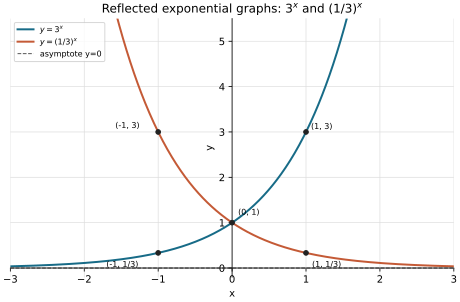
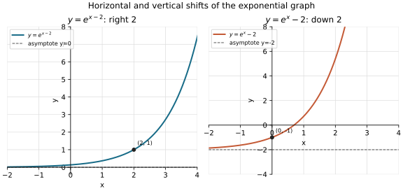

# Homework 3 Solutions

Based on [Lecture 3: Exponential Functions](../Notes/N3.md).

**Exercise 1 (routine).** Simplify each using the addition and quotient
rules:

* $2^5\cdot2^{-7}$
* $\dfrac{3^{x+2}}{3^{x-1}}$
* $\dfrac{5^{2x}\cdot5^{-3}}{5^{x-4}}$

Using $b^m b^n=b^{m+n}$ and $b^m/b^n=b^{m-n}$:

* $2^5\cdot2^{-7}=2^{5-7}=\boxed{2^{-2}=\dfrac14}$.
* $\dfrac{3^{x+2}}{3^{x-1}}=3^{(x+2)-(x-1)}=3^3=\boxed{27}$.
* $\dfrac{5^{2x}\cdot5^{-3}}{5^{x-4}}
  =5^{2x-3-(x-4)}=5^{x+1}=\boxed{5^{x+1}}$.

**Exercise 2 (algebraic).** Simplify each completely:

* $\left(2^{x}\right)^{3}\cdot 2^{-2x}$
* $\left(3^{x}\right)^{2}\cdot 3^{-x+1}$
* $\dfrac{(2^{2x})^{-1}\cdot2^{x+5}}{4^{x-1}}$

* $(2^x)^3\cdot2^{-2x}=2^{3x}2^{-2x}=\boxed{2^x}$.
* $(3^x)^2\cdot3^{-x+1}=3^{2x-x+1}=\boxed{3^{x+1}}$.
* Rewrite $4^{x-1}=2^{2x-2}$. Then
  $$
  \frac{(2^{2x})^{-1}\cdot2^{x+5}}{4^{x-1}}
  =\frac{2^{-2x}2^{x+5}}{2^{2x-2}}
  =2^{-2x+x+5-(2x-2)}=\boxed{2^{7-3x}}.
  $$

**Exercise 3 (equations).** Solve for $x$ in each. (Use that $b^x=b^y$
implies $x=y$ when $b>0$, $b\neq1$.)

* $5^{2x-1}=5^{x+4}$
* $2^{3x}=2^{x+8}$
* $4^{x+1}=8^{2x-1}$ (write both sides as powers of $2$ first)

* $2x-1=x+4$, so $\boxed{x=5}$.
* $3x=x+8$, so $2x=8$ and $\boxed{x=4}$.
* Write both sides with base $2$:
  $$4^{x+1}=2^{2x+2},\qquad 8^{2x-1}=2^{6x-3}.$$
  Thus $2x+2=6x-3$, so $5=4x$ and $\boxed{x=\frac54}$.

**Exercise 4 (rational exponents).** Evaluate each exactly, then rewrite
any negative exponent as a reciprocal:

* $16^{3/4}$
* $27^{-2/3}$
* $81^{1/2}$

* $16^{3/4}=(\sqrt[4]{16})^3=2^3=\boxed{8}$.
* $27^{-2/3}=1/(27^{2/3})=1/(\sqrt[3]{27})^2=\boxed{\dfrac19}$.
* $81^{1/2}=\sqrt{81}=\boxed{9}$.

**Exercise 5 (features).** State the domain, range, $y$-intercept, and
horizontal asymptote of $y=5^x$, and say whether it is increasing or
decreasing.

The base $5$ is positive and greater than $1$, so $5^x$ is defined and
positive for every real $x$, and is increasing. Also $5^0=1$, and as
$x\to-\infty$, $5^x\to0^+$ without reaching zero. Thus the domain is
$\boxed{(-\infty,\infty)}$, the range is $\boxed{(0,\infty)}$, the
$y$-intercept is $\boxed{(0,1)}$, the horizontal asymptote is
$\boxed{y=0}$, and the function is $\boxed{\text{increasing}}$.

**Exercise 6 (comparison).** Without a calculator, decide which is larger:
$3^{0.4}$ or $3^{0.5}$? Which is larger: $(1/3)^{0.4}$ or
$(1/3)^{0.5}$? Explain using monotonicity.

Because $3>1$, $3^x$ is increasing, and $0.5>0.4$. Hence
$\boxed{3^{0.5}>3^{0.4}}$. Because $0<1/3<1$, $(1/3)^x$ is decreasing,
so $\boxed{(1/3)^{0.4}>(1/3)^{0.5}}$.

**Exercise 7 (sketch).** Sketch $y=(1/3)^x$ on the same axes as $y=3^x$.
Label their common point, the horizontal asymptote, and the points with
$x=1$ and $x=-1$ on each graph.

Since $(1/3)^x=3^{-x}$, this graph reflects $y=3^x$ across the $y$-axis.
Both pass through $(0,1)$ and have horizontal asymptote $y=0$. The
requested points are $(1,3)$ and $(-1,1/3)$ on $y=3^x$, and $(1,1/3)$ and
$(-1,3)$ on $y=(1/3)^x$.

{width=300px}

**Exercise 8 (routine).** \$500 is invested at $4\%$ annual interest,
compounded continuously. Write the formula for $A(t)$ and find the balance
after $20$ years (leave the answer in terms of $e$, then approximate using
$e^{0.8}\approx2.2255$).

For continuous compounding, $A(t)=Pe^{rt}$. Here $P=500$ and $r=0.04$, so
$$A(t)=\boxed{500e^{0.04t}}.$$
After $20$ years,
$$
A(20)=500e^{0.04(20)}=\boxed{500e^{0.8}}
\approx500(2.2255)=\boxed{\$1112.75}.
$$

**Exercise 9 (calculator comparison).** \$1000 earns $6\%$ annual interest
for $5$ years. Write the balance if it is compounded quarterly, then write
the continuous-compounding balance. Use a calculator to approximate both
amounts to the nearest cent and state which is larger.

Quarterly compounding has $n=4$ periods per year, so
$$
A_q=1000\left(1+\frac{0.06}{4}\right)^{4(5)}
=1000(1.015)^{20}\approx\boxed{\$1346.86}.
$$
For continuous compounding,
$$A_c=1000e^{0.06(5)}=1000e^{0.3}\approx\boxed{\$1349.86}.$$
The continuous-compounding balance is larger.

**Exercise 10 (reasoning).** Explain, using the formula
$A(t)=P(1+r/n)^{nt}$ and the definition of $e$, why continuous
compounding gives a *larger* balance than compounding once a year, for the
same $P$, $r$, and $t>0$.

With annual compounding the balance is $P(1+r)^t$; the continuous limit is
$Pe^{rt}=P(e^r)^t$. For $r>0$, the definition
$e^r=\lim_{n\to\infty}(1+r/n)^n$ gives $e^r>1+r$: for integer $n\ge2$,
the binomial expansion has first two terms $1+r$, and its positive
quadratic term is
$$
\binom{n}{2}\left(\frac{r}{n}\right)^2
=\frac{r^2(n-1)}{2n}\ge\frac{r^2}{4}>0.
$$
Thus $e^r>1+r$. Raising these positive bases to $t>0$ preserves their
ordering, and multiplying by $P>0$ shows $Pe^{rt}>P(1+r)^t$. Therefore
continuous compounding gives the larger balance.

**Exercise 11 (features).** For $y=3\cdot2^{x}-4$: state the horizontal
asymptote, the $y$-intercept, and whether the graph is increasing or
decreasing.

The graph is a vertical scale of $2^x$ by $3$, followed by a shift down
$4$. Its horizontal asymptote is $\boxed{y=-4}$. At $x=0$,
$y=3(1)-4=-1$, so the $y$-intercept is $\boxed{(0,-1)}$. Since $2^x$ is
increasing and the scale factor is positive, the function is
$\boxed{\text{increasing}}$.

**Exercise 12 (transformations).** For $y=-2^{x+1}+3$: describe the
transformations from $y=2^x$ in order, then state the horizontal asymptote
and the point corresponding to $(0,1)$ on the parent graph.

Starting at $y=2^x$, shift left $1$ to get $2^{x+1}$, reflect across the
$x$-axis to get $-2^{x+1}$, then shift up $3$. The horizontal asymptote is
$\boxed{y=3}$. The parent point $(0,1)$ moves to $(-1,1)$, then
$(-1,-1)$, and finally $\boxed{(-1,2)}$.

**Exercise 13 (sketch and explain).** Sketch $y=e^{x-2}$ and $y=e^{x}-2$
on separate axes. Explain in one sentence why these two graphs are
different, even though both come from shifting $y=e^x$ by $2$.

For $y=e^{x-2}$, shift $y=e^x$ right $2$: its horizontal asymptote stays
$y=0$ and $(0,1)$ moves to $(2,1)$. For $y=e^x-2$, shift the parent down
$2$: its asymptote becomes $y=-2$ and $(0,1)$ moves to $(0,-1)$. They are
different because one shift is horizontal and the other is vertical.

{width=300px}

**Exercise 14 (harder).** A bacteria colony is modeled by
$N(t)=500\cdot 2^{t/3}$, where $t$ is measured in hours. Show directly
that $N(t+3)=2N(t)$, then state the horizontal asymptote and explain what
it means in the context of the model. (A later logarithms lecture will
show how to rewrite this model using $e$.)

Substitute $t+3$ and use the addition rule:
$$
N(t+3)=500\cdot2^{(t+3)/3}
=500\cdot2^{t/3+1}=2\left(500\cdot2^{t/3}\right)=\boxed{2N(t)}.
$$
The horizontal asymptote is $\boxed{N=0}$. Mathematically,
$500\cdot2^{t/3}\to0$ as $t\to-\infty$, so the extended model approaches
zero but never reaches it. In the colony context, time is ordinarily
$t\ge0$, where the model predicts growth from 500 bacteria; the asymptote
describes the backward extension rather than a future extinction level.

**Exercise 15 (calculator routine).** A population of $5{,}000$ bacteria
grows $8\%$ per hour. Write $P(t)$ in percentage-rate form and use a
calculator to find the population after $3$ hours, rounded to the nearest
whole bacterium.

The per-hour growth multiplier is $1+0.08=1.08$, so
$$
P(t)=\boxed{5000(1.08)^t},\qquad
P(3)=5000(1.08)^3=5000(1.259712)=6298.56\approx\boxed{6299\text{ bacteria}}.
$$

**Exercise 16 (routine).** A machine worth \$8{,}000 depreciates $20\%
per year. Write $V(t)$ in percentage-rate form, state whether this is
growth or decay and why, and find its value after $3$ years.

After losing $20\%$, the machine retains $80\%$ of its value each year.
Thus $V(t)=\boxed{8000(0.80)^t}$. This is decay because the multiplier
$0.80$ is between $0$ and $1$. After three years,
$$V(3)=8000(0.80)^3=8000(0.512)=\boxed{\$4096}.$$

**Exercise 17 (half-life).** A radioactive sample has a half-life of $6$
hours and starts at $A_0=80$ g. Find the amount remaining after $18$ hours,
without a calculator.

Eighteen hours is $18/6=3$ half-lives, so
$$
A(18)=80\left(\frac12\right)^{18/6}
=80\left(\frac12\right)^3=80\cdot\frac18=\boxed{10\text{ g}}.
$$

**Exercise 18 (doubling time).** A culture of yeast doubles every $2$ hours,
starting from $200$ cells. Write $P(t)$ in doubling-time form, and find the
population after $8$ hours.

The doubling-time form is $P(t)=\boxed{200\cdot2^{t/2}}$. After $8$ hours
there have been $8/2=4$ doublings:
$$P(8)=200\cdot2^4=\boxed{3200\text{ cells}}.$$

**Exercise 19 (model from data).** A culture has $300$ cells at $t=0$ and
$1200$ cells at $t=4$ hours. Assume $P(t)=ab^t$.

* Find $a$ and $b$.
* Write the model $P(t)$.
* Use it to predict the population after $6$ hours.

At $t=0$, $300=P(0)=ab^0=a$, so $a=300$. At $t=4$,
$$1200=300b^4\quad\Longrightarrow\quad b^4=4.$$
An exponential base is positive, so $b=\sqrt[4]{4}=\sqrt2$. Thus
$$\boxed{P(t)=300(\sqrt2)^t}.$$
After six hours,
$$P(6)=300(\sqrt2)^6=300\cdot8=\boxed{2400\text{ cells}}.$$

**Exercise 20 (challenge).** Show that the percentage-rate form
$P(t)=P_0(1+r)^t$ and the doubling-time form $P(t)=P_0\cdot2^{t/d}$
describe the same function exactly when $1+r=2^{1/d}$ -- that is, a growth
rate $r$ per period corresponds to doubling time $d$.

For the two formulas to agree for every $t$, their values at one period,
$t=1$, must agree. Assuming $P_0>0$, divide both by $P_0$ to get
$$
(1+r)^1=2^{1/d}.
$$
This condition is necessary. Conversely, if $1+r=2^{1/d}$, then for every
$t$,
$$
P_0(1+r)^t=P_0\left(2^{1/d}\right)^t=P_0\cdot2^{t/d},
$$
so the formulas agree exactly. The condition is therefore
$\boxed{1+r=2^{1/d}}$.
