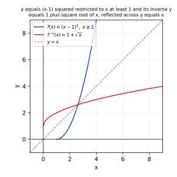
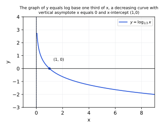
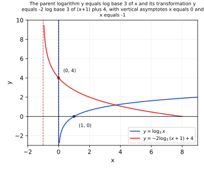
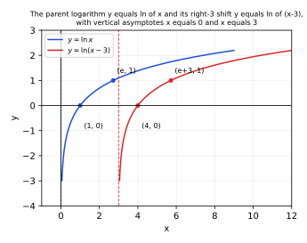
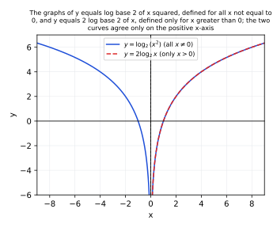

# Homework 3 Solutions

Based on [Lecture 4: Inverse and Logarithmic Functions](../Notes/N4.md).

**Exercise 1 (one-to-one).** Use the horizontal line test or an algebraic
reason to decide whether each function is one-to-one on the stated domain.

* $f(x)=4x-1$ on $\mathbb R$
* $g(x)=x^2-3$ on $\mathbb R$
* $h(x)=x^2-3$ on $[0,\infty)$

**$f(x)=4x-1$ on $\mathbb R$.** Suppose $f(x_1)=f(x_2)$. Then
$4x_1-1=4x_2-1$, so $4x_1=4x_2$, so $x_1=x_2$. Equal outputs force equal
inputs, so $f$ is $\boxed{\text{one-to-one}}$. (Graphically, every
horizontal line $y=c$ meets the line $4x-1=c$ at the single point
$x=(c+1)/4$.)

**$g(x)=x^2-3$ on $\mathbb R$.** $g(2)=4-3=1$ and $g(-2)=4-3=1$, so the two
distinct inputs $2$ and $-2$ give the same output. Thus $g$ is
$\boxed{\text{not one-to-one}}$. (The horizontal line $y=1$ crosses the
graph twice, at $x=2$ and $x=-2$.)

**$h(x)=x^2-3$ on $[0,\infty)$.** Suppose $x_1,x_2\ge0$ and
$h(x_1)=h(x_2)$, i.e. $x_1^2-3=x_2^2-3$, so $x_1^2=x_2^2$, so
$x_1=\pm x_2$. Since $x_1,x_2\ge0$, the only possibility is $x_1=x_2$
(if $x_1=-x_2$ with both nonnegative, then $x_1=x_2=0$, which is a special
case of $x_1=x_2$ anyway). Thus $h$ is $\boxed{\text{one-to-one}}$ on this
restricted domain, even though the same formula failed to be one-to-one on
all of $\mathbb R$.

**Exercise 2 (inverse).** Find the inverse of $f(x)=\dfrac{x+4}{3}$, then
verify both compositions.

Write $y=\dfrac{x+4}{3}$ and solve for $x$:
$$
3y=x+4
\quad\Longrightarrow\quad
x=3y-4.
$$
Swap the variable names. Thus
$$
\boxed{f^{-1}(x)=3x-4}.
$$
Check both compositions:
$$
f^{-1}(f(x))=3\left(\frac{x+4}3\right)-4=(x+4)-4=x,
$$
$$
f(f^{-1}(x))=\frac{(3x-4)+4}{3}=\frac{3x}{3}=x.
$$
Both equal $x$, confirming the inverse.

**Exercise 3 (restricted inverse).** Restrict $f(x)=(x-1)^2$ to $x\ge1$.
Find $f^{-1}(x)$ and state the domain and range of both $f$ and $f^{-1}$.

**Domain and range of $f$.** By restriction, $\operatorname{dom}(f)=[1,\infty)$.
For $x\ge1$, $x-1\ge0$, so $(x-1)^2$ ranges over every value in
$[0,\infty)$ as $x-1$ ranges over $[0,\infty)$; hence
$\operatorname{range}(f)=[0,\infty)$.

**Finding the inverse.** Write $y=(x-1)^2$ with $x\ge1$, and solve for
$x$. Taking square roots of both sides gives $\sqrt{y}=|x-1|$. Since
$x\ge1$ means $x-1\ge0$, we have $|x-1|=x-1$, so
$$
\sqrt{y}=x-1
\quad\Longrightarrow\quad
x=1+\sqrt{y}.
$$
Swap the variable names. Thus
$$
\boxed{f^{-1}(x)=1+\sqrt{x}}.
$$

**Domain and range of $f^{-1}$.** Since
$\operatorname{dom}(f^{-1})=\operatorname{range}(f)$ and
$\operatorname{range}(f^{-1})=\operatorname{dom}(f)$, we get
$\operatorname{dom}(f^{-1})=[0,\infty)$ and
$\operatorname{range}(f^{-1})=[1,\infty)$. (Directly: for $x\ge0$,
$1+\sqrt{x}\ge1$, matching $\operatorname{dom}(f)=[1,\infty)$.)

Check: $f^{-1}(f(x))=1+\sqrt{(x-1)^2}=1+|x-1|=1+(x-1)=x$ for $x\ge1$, and
$f(f^{-1}(x))=\left(\big(1+\sqrt x\big)-1\right)^2=(\sqrt x)^2=x$ for
$x\ge0$.

{width=300px}

**Exercise 4 (translation).** Rewrite each statement in the other form.

* $4^3=64$
* $10^{-4}=0.0001$
* $\log_7 49=2$
* $\ln(e^{-3})=-3$

Using $\log_bx=y\iff b^y=x$:

* $\boxed{\log_4 64=3}$
* $\boxed{\log_{10}(0.0001)=-4}$
* $\boxed{7^2=49}$
* $\boxed{e^{-3}=e^{-3}}$ (the exponential form of a natural-log statement
 about $e^{-3}$ is simply the tautology $e^{-3}=e^{-3}$, since the base of
 $\ln$ is $e$ and the stated exponent is already $-3$; this confirms the
 original statement is consistent with the definition).

**Exercise 5 (exact values).** Evaluate without a calculator.

* $\log_2 32$
* $\log_9 3$
* $\log_{10}(0.01)$
* $\ln1$

Each value is the exponent that produces the argument:

* $2^5=32$, so $\boxed{\log_2 32=5}$.
* $9^{1/2}=\sqrt9=3$, so $\boxed{\log_9 3=\tfrac12}$.
* $10^{-2}=0.01$, so $\boxed{\log_{10}(0.01)=-2}$.
* $e^0=1$, so $\boxed{\ln1=0}$.

**Exercise 6 (features).** State the domain, range, $x$-intercept, vertical
asymptote, and monotonicity of $y=\log_{1/3}x$, then plot the graph,
labeling the asymptote.

Here $b=\tfrac13$, which satisfies $0<b<1$:

* Domain: $\boxed{(0,\infty)}$
* Range: $\boxed{(-\infty,\infty)}$
* $x$-intercept: $\boxed{(1,0)}$ (since $\log_b1=0$ for any valid base $b$)
* Vertical asymptote: $\boxed{x=0}$
* Monotonicity: since $0<b<1$, $y=\log_{1/3}x$ is $\boxed{\text{decreasing}}$

{width=300px}

**Exercise 7 (log rules).** Expand each expression as far as possible.
Assume all variables are positive.

* $\log_5\left(\dfrac{25x}{z^2}\right)$
* $\ln\left(\dfrac{\sqrt{x}}{3y}\right)$
* $\log_2(16a^4b)$

**(a)** Using the quotient rule, then the product rule, then the power rule:
$$
\log_5\left(\frac{25x}{z^2}\right)
=\log_5(25x)-\log_5(z^2)
=\log_525+\log_5x-2\log_5z
=\boxed{2+\log_5x-2\log_5z}.
$$

**(b)** Writing $\sqrt x=x^{1/2}$ and using the quotient, product, and power
rules:
$$
\ln\left(\frac{\sqrt{x}}{3y}\right)
=\ln\sqrt{x}-\ln(3y)
=\tfrac12\ln x-(\ln3+\ln y)
=\boxed{\tfrac12\ln x-\ln3-\ln y}.
$$

**(c)** Using the product rule, then the power rule, and $16=2^4$:
$$
\log_2(16a^4b)
=\log_216+\log_2a^4+\log_2b
=4+4\log_2a+\log_2b
=\boxed{4+4\log_2a+\log_2b}.
$$

**Exercise 8 (exact equations).** Solve exactly.

* $3^{2x-1}=27$
* $\log_2(x-1)=4$
* $\ln(x+2)=0$

**(a)** Write $27=3^3$, so both sides share base $3$:
$$
3^{2x-1}=3^3
\quad\Longrightarrow\quad
2x-1=3
\quad\Longrightarrow\quad
2x=4
\quad\Longrightarrow\quad
\boxed{x=2}.
$$

**(b)** Convert to exponential form:
$$
\log_2(x-1)=4
\quad\Longrightarrow\quad
x-1=2^4=16
\quad\Longrightarrow\quad
\boxed{x=17}.
$$
(Domain check: $x-1=16>0$. Valid.)

**(c)** Convert to exponential form:
$$
\ln(x+2)=0
\quad\Longrightarrow\quad
x+2=e^0=1
\quad\Longrightarrow\quad
\boxed{x=-1}.
$$
(Domain check: $x+2=1>0$. Valid.)

**Exercise 9 (extraneous solutions).** Solve each equation, then check
every candidate solution against the domain of the original logarithms
and discard any extraneous root.

* $\log_3(x+2)+\log_3x=1$
* $\log(x)+\log(x-3)=1$

**(a)** The original equation requires $x+2>0$ and $x>0$, i.e. $x>0$.
Combine with the product rule, then convert to exponential form:
$$
\log_3\big[x(x+2)\big]=1
\quad\Longrightarrow\quad
x^2+2x=3^1=3
\quad\Longrightarrow\quad
x^2+2x-3=0
\quad\Longrightarrow\quad
(x+3)(x-1)=0,
$$
so $x=-3$ or $x=1$. Since $x=-3$ fails $x>0$, it is extraneous and
rejected. Only $\boxed{x=1}$ solves the original equation. (Check:
$\log_33+\log_31=1+0=1$.)

**(b)** (Base $10$.) The original equation requires $x>0$ and $x-3>0$,
i.e. $x>3$. Combine with the product rule, then convert to exponential
form:
$$
\log\big[x(x-3)\big]=1
\quad\Longrightarrow\quad
x^2-3x=10^1=10
\quad\Longrightarrow\quad
x^2-3x-10=0
\quad\Longrightarrow\quad
(x-5)(x+2)=0,
$$
so $x=5$ or $x=-2$. Since $x=-2$ fails $x>3$, it is extraneous and
rejected. Only $\boxed{x=5}$ solves the original equation. (Check:
$\log5+\log2=\log10=1$.)

**Exercise 10 (calculator equations).** Use a calculator and round each
answer to three decimal places.

**(a) $2^x=7$.** Take $\ln$ of both sides:
$$
x\ln2=\ln7
\quad\Longrightarrow\quad
x=\frac{\ln7}{\ln2}=\frac{1.945910}{0.693147}
\approx\boxed{2.807}.
$$

**(b) $5e^{0.4t}=60$.** Divide, then take $\ln$:
$$
e^{0.4t}=12
\quad\Longrightarrow\quad
0.4t=\ln12
\quad\Longrightarrow\quad
t=\frac{\ln12}{0.4}=\frac{2.484907}{0.4}
\approx\boxed{6.212}.
$$

**(c) $\log_3(x+1)=2.7$.** Convert to exponential form:
$$
x+1=3^{2.7}=e^{2.7\ln3}=e^{2.966253}\approx19.41920
\quad\Longrightarrow\quad
x\approx\boxed{18.419}.
$$

**Exercise 11 (features).** For $y=-2\log_3(x+1)+4$, describe the
transformations from $y=\log_3x$, then state the domain, vertical asymptote,
and the point corresponding to $(1,0)$.

**Transformations.** Starting from $y=\log_3x$: replace $x$ by $x+1$ to
shift left $1$; multiply by $2$ to scale vertically; the minus sign
reflects the result across the $x$-axis; finally add $4$ to shift up $4$.

**Domain and asymptote.** The argument requires $x+1>0$, i.e. $x>-1$, so
the domain is $\boxed{(-1,\infty)}$ and the vertical asymptote is
$\boxed{x=-1}$ (the vertical shift by $4$ does not move the asymptote).

**Image of $(1,0)$.** A point $(a,b)$ on $y=\log_3x$ maps, under
$x\mapsto x-1$ (i.e. a *left* shift by $1$, so $h=-1$ in the transformation
$x-h$) and $y\mapsto-2y+4$, to $(a+h,\,-2b+4)=(a-1,\,-2b+4)$. With
$(a,b)=(1,0)$, the image is $(1-1,\,-2\cdot0+4)=\boxed{(0,4)}$. (Check
directly: at $x=0$, $y=-2\log_3(0+1)+4=-2\cdot0+4=4$, matching.)

{width=320px}

**Exercise 12 (sketch).** Sketch $y=\ln(x-3)$, labeling its vertical
asymptote and two points obtained from $y=\ln x$.

Starting from $y=\ln x$, shift right $3$. The vertical asymptote moves
from $x=0$ to $\boxed{x=3}$, and the domain becomes $x>3$. Two convenient
points on $y=\ln x$ are $(1,0)$ and $(e,1)$ (since $\ln1=0$ and $\ln e=1$);
shifting each right $3$ gives $(4,0)$ and $(e+3,1)\approx(5.718,1)$ on
$y=\ln(x-3)$.

{width=320px}

**Exercise 13 (challenge).** Explain why $y=\log_2(x^2)$ is not the same
function as $y=2\log_2x$. State the domain of each function and identify
where their formulas agree.

**Domains.** For $y=\log_2(x^2)$, the argument $x^2$ is positive for every
$x\neq0$, so the domain is $\boxed{(-\infty,0)\cup(0,\infty)}$. For
$y=2\log_2x$, the argument $x$ itself must be positive, so the domain is
$\boxed{(0,\infty)}$.

**Why the functions differ.** Two functions are equal only if they share
the same domain and agree on it. Here $\log_2(x^2)$ is defined at, say,
$x=-1$ (giving $\log_2 1=0$), while $2\log_2x$ is undefined there (since
$\log_2(-1)$ does not exist). Because one function has points in its
domain where the other is undefined, they are **not the same function**,
even though their formulas look related.

**Where the formulas agree.** By the power rule applied to $|x|$,
$\log_2(x^2)=\log_2(|x|^2)=2\log_2|x|$ for every $x\neq0$. For $x>0$,
$|x|=x$, so $2\log_2|x|=2\log_2x$ — the two formulas coincide. For $x<0$,
$2\log_2|x|=2\log_2(-x)$ is a real number, but $2\log_2x$ is undefined
there. Hence the formulas agree exactly on
$\boxed{(0,\infty)}$, the (smaller) domain of $y=2\log_2x$.

{width=320px}

**Exercise 14 (pH).** A solution has $[\mathrm{H}^+]=10^{-6.2}$. Find its
pH. How many times greater is its hydrogen-ion concentration than a
solution with pH $8.2$?

**pH of the first solution.**
$$
\mathrm{pH}=-\log_{10}\!\left(10^{-6.2}\right)=-(-6.2)=\boxed{6.2}.
$$

**Comparing concentrations.** A solution with pH $8.2$ has
$[\mathrm H^+]_2=10^{-8.2}$ (from $\mathrm{pH}=-\log_{10}[\mathrm H^+]$
solved for the concentration: $[\mathrm H^+]=10^{-\mathrm{pH}}$). The
ratio of concentrations is
$$
\frac{[\mathrm H^+]_1}{[\mathrm H^+]_2}
=\frac{10^{-6.2}}{10^{-8.2}}
=10^{(-6.2)-(-8.2)}
=10^{2}=\boxed{100}.
$$
The pH-$6.2$ solution has $100$ times the hydrogen-ion concentration of
the pH-$8.2$ solution.

**Exercise 15 (decibels).** A sound changes from $50$ dB to $80$ dB. By
what factor does its intensity change? Explain using the formula for $L$.

From $L=10\log_{10}(I/I_0)$, solve for the intensity ratio:
$\log_{10}(I/I_0)=L/10$, so $I/I_0=10^{L/10}$. Thus
$$
\frac{I_1}{I_0}=10^{50/10}=10^5,
\qquad
\frac{I_2}{I_0}=10^{80/10}=10^8.
$$
The factor by which intensity changes is
$$
\frac{I_2}{I_1}=\frac{I_2/I_0}{I_1/I_0}=\frac{10^8}{10^5}=10^3=\boxed{1000}.
$$
A $30$-decibel increase is three $10$-decibel steps, and each $10$-decibel
step multiplies intensity by $10$ (since $10\log_{10}10=10$), so
$30$ decibels multiplies intensity by $10^3=1000$.

**Exercise 16 (calculator application).** A \$5000 investment earns $5\%$
annual interest compounded continuously. Use logarithms to find how long it
takes to reach \$8000. Round to two decimal places.

Using $t=\dfrac{\ln(A/P)}{r}$ with $A=8000$, $P=5000$, $r=0.05$:
$$
t=\frac{\ln(8000/5000)}{0.05}=\frac{\ln(1.6)}{0.05}=\frac{0.470004}{0.05}
\approx\boxed{9.40\text{ years}}.
$$

**Exercise 17 (modeling, calculator).** A bacteria culture follows
$P(t)=300\cdot2^{t/4}$, where $t$ is measured in hours. Use logarithms to
find when the population first reaches $5000$. Give an exact logarithmic
expression and a calculator approximation in hours.

Set $P(t)=5000$ and solve for $t$:
$$
300\cdot2^{t/4}=5000
\quad\Longrightarrow\quad
2^{t/4}=\frac{5000}{300}=\frac{50}{3}.
$$
Take $\log_2$ of both sides:
$$
\frac{t}{4}=\log_2\!\left(\frac{50}{3}\right)
\quad\Longrightarrow\quad
\boxed{t=4\log_2\!\left(\frac{50}{3}\right)}.
$$
Using the change-of-base formula $\log_2\!\left(\frac{50}3\right)
=\dfrac{\ln(50/3)}{\ln2}=\dfrac{2.813411}{0.693147}\approx4.058894$:
$$
t\approx4(4.058894)\approx\boxed{16.24\text{ hours}}.
$$

**Exercise 18 (challenge).** Let $f(x)=a^x$ for $a>0$, $a\neq1$. Prove
that $f^{-1}(x)=\log_ax$ directly by checking both compositions, including
the necessary domain restrictions.

**Step 1: $f$ is one-to-one, so an inverse exists.** Suppose $a>1$ and
$x_1<x_2$. Exponential functions with base greater than $1$ are
increasing, so $a^{x_1}<a^{x_2}$, i.e. $f(x_1)\neq f(x_2)$. Suppose instead
$0<a<1$ and $x_1<x_2$; then $a^x$ is decreasing, so $a^{x_1}>a^{x_2}$,
again $f(x_1)\neq f(x_2)$. In either case distinct inputs give distinct
outputs, so $f$ is one-to-one on $\mathbb R$ and an inverse function
exists. Also $\operatorname{dom}(f)=\mathbb R$ and, since $a^x>0$ for every
real $x$ and every positive target value $x_0$ is achieved by
$f(\log_ax_0)$ (verified in Step 2 below), $\operatorname{range}(f)=(0,\infty)$.

**Step 2: define $g(x)=\log_ax$ on $x>0$ and check $f(g(x))=x$.** By the
definition of the logarithm, $\log_ax=y$ means exactly $a^y=x$. Setting
$y=\log_ax$, this definition directly gives $a^{\log_ax}=x$, i.e.
$$
f(g(x))=a^{\log_ax}=x\qquad\text{for all }x>0=\operatorname{dom}(g).
$$

**Step 3: check $g(f(x))=x$.** We must show $\log_a(a^x)=x$ for every real
$x$. By definition, $\log_a(a^x)$ is the unique real number $t$ satisfying
$a^t=a^x$. Since $f(t)=a^t$ is one-to-one (Step 1), the equation $a^t=a^x$
has exactly one solution, namely $t=x$. Hence
$$
g(f(x))=\log_a(a^x)=x\qquad\text{for all }x\in\mathbb R=\operatorname{dom}(f).
$$

**Conclusion.** Both compositions return the identity on the correct
domains: $f\circ g=\mathrm{id}$ on $\operatorname{dom}(g)=(0,\infty)=
\operatorname{range}(f)$, and $g\circ f=\mathrm{id}$ on
$\operatorname{dom}(f)=\mathbb R=\operatorname{range}(g)$. This is exactly
the defining property of an inverse function, so
$$
\boxed{f^{-1}(x)=\log_ax,\qquad \operatorname{dom}(f^{-1})=(0,\infty),\qquad
\operatorname{range}(f^{-1})=\mathbb R.}
$$
