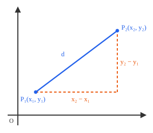
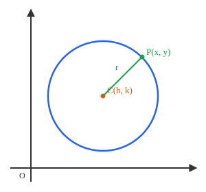
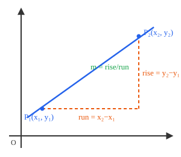
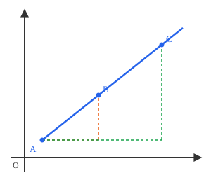
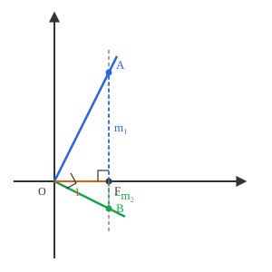
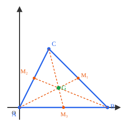

## Lecture 1: Coordinates, Lines, and Circles

Euclidean geometry studies shapes through size, angle, and relationship;
analytic geometry studies the same shapes by assigning numbers to points, so
that geometric facts turn into algebraic equations. A point becomes an ordered
pair $(x,y)$, a curve becomes an equation in $x$ and $y$, and questions about
length, parallelism, and intersection become questions we can settle by
algebra. The coordinate plane does not replace Euclidean geometry; it gives a
second language for the same ideas. This lecture builds the dictionary between
the two.

### 1. A Dictionary Between Two Languages

| Euclidean geometry | Coordinate geometry |
|---|---|
| point | ordered pair $(a,b)$ |
| curve / shape (set of points satisfying a property) | equation in $x,y$ (set of solutions) |
| distance between two points | $\sqrt{(x_2-x_1)^2+(y_2-y_1)^2}$ |
| midpoint of a segment | $\left(\frac{x_1+x_2}{2},\frac{y_1+y_2}{2}\right)$ |
| circle (all points at fixed distance from a center) | equation $(x-h)^2+(y-k)^2=r^2$ |
| steepness / direction of a line | slope $m=\frac{y_2-y_1}{x_2-x_1}$ |
| two points determine a line | $y-y_1=\frac{y_2-y_1}{x_2-x_1}(x-x_1)$ |
| two lines intersect in one point | the system $y=m_1x+b_1$, $y=m_2x+b_2$ has the unique solution $x=\frac{b_2-b_1}{m_1-m_2}$ when $m_1\neq m_2$ |
| parallel lines | equal slopes $m_1=m_2$ |
| perpendicular lines | $m_1m_2=-1$ |
| median from a vertex | segment from $(x_1,y_1)$ to $\left(\frac{x_2+x_3}{2},\frac{y_2+y_3}{2}\right)$ |
| centroid | average of the vertices: $\left(\frac{x_1+x_2+x_3}{3},\frac{y_1+y_2+y_3}{3}\right)$ |
| altitude from a vertex | line through that vertex with slope $-1/m$, where $m$ is the slope of the opposite side |
| orthocenter | common solution of the three altitude equations |

This dictionary is the foundation of analytic geometry, and we will return to
it all term: a geometric statement such as “the lines are perpendicular”
becomes an algebraic statement, “the slopes multiply to $-1$.” The last four
entries are developed in the final two sections.

### 2. Points as Coordinates

A point $(a,b)$ is determined by two signed distances: $a$ is the signed
distance from the $y$-axis, and $b$ is the signed distance from the $x$-axis.
The two axes cut the plane into four **quadrants**, numbered I–IV
counterclockwise starting from the upper right, where both coordinates are
positive.

**Example.** The point $C(3,2)$ means “move 3 units right and 2 units up.”

**Translation rules.** Shifting a point is addition in one coordinate:

- vertical shift: $(a,b)\mapsto(a,b+c)$,
- horizontal shift: $(a,b)\mapsto(a+c,b)$.

**Exercise 1.** Plot $(3,-2)$, $(-4,1)$, and $(0,5)$, and say which quadrant
(or axis) each lies in. Where does each point go under
$(a,b)\mapsto(a+3,b-1)$?

### 3. Distance and Midpoint

**Definition.** The distance between $P_1(x_1,y_1)$ and $P_2(x_2,y_2)$ is
$$d = \sqrt{(x_2-x_1)^2 + (y_2-y_1)^2}.$$

**Proof.** The horizontal and vertical legs of the right triangle have lengths
$|x_2-x_1|$ and $|y_2-y_1|$, respectively. By the Pythagorean theorem,
$$d^2 = (x_2-x_1)^2 + (y_2-y_1)^2.$$
Taking square roots gives the stated formula. $\blacksquare$

**Midpoint formula.** The midpoint of $(x_1,y_1)$ and $(x_2,y_2)$ is
$$M=\left(\frac{x_1+x_2}{2},\ \frac{y_1+y_2}{2}\right),$$
the average of the corresponding coordinates. Distance uses the *differences*
of coordinates; the midpoint uses their *averages*.

**Exercise 2.** Find the distance between $(1,1)$ and $(4,5)$.

**Exercise 3.** Show that $(0,0)$, $(3,0)$, and $(0,4)$ form a right triangle
using the distance formula.

**Exercise 4.** Find the midpoint of $(-3,4)$ and $(5,-2)$, and verify by the
distance formula that it is equidistant from both.

**Exercise 5.** A point $(x,0)$ on the $x$-axis is equidistant from $(1,2)$ and
$(5,-4)$. Find $x$.

### 4. Circles

**Definition (Euclidean).** A circle with center $C$ and radius $r$ is the set
of all points whose distance from $C$ is exactly $r$.

**Coordinate formula.** A point $(x,y)$ lies on the circle with center $(h,k)$
and radius $r$ if and only if its distance from $(h,k)$ is $r$; equivalently,
$$(x-h)^2 + (y-k)^2 = r^2.$$

**Example.** The circle centered at the origin with radius $1$ has equation
$x^2+y^2=1$, the unit circle.

**Exercise 6.** Write the equation of the circle with center $(2,-1)$ and
radius $3$.

**Exercise 7.** Does the point $(4,3)$ lie on, inside, or outside the circle
$x^2+y^2=20$?

**Exercise 8.** The equation $x^2+y^2-4x+6y-12=0$ represents a circle.
Complete the square to write it in standard form $(x-h)^2+(y-k)^2=r^2$, then
find its center and radius.

**Exercise 9.** Find the equation of the circle passing through the three
points $(0,0)$, $(4,0)$, and $(0,-2)$.

*Hint.* Two routes, one in each language. Algebraically: substitute the three
points into $x^2+y^2+Dx+Ey+F=0$ and solve for $D$, $E$, $F$. Geometrically:
the angle at $(0,0)$ is a right angle, so the segment joining the other two
points is a diameter — now use the midpoint formula.

### 5. Lines and Slope

**Definition.** For two points $(x_1,y_1)$ and $(x_2,y_2)$ with $x_1\neq x_2$,
the slope of the line through them is
$$m = \frac{y_2-y_1}{x_2-x_1}.$$

**Sign of the slope.**

- $m>0$: the line rises from left to right.
- $m<0$: the line falls from left to right.
- $m=0$: the line is horizontal.
- undefined: the line is vertical.

**Examples.** A horizontal line $y=b$ has no rise, so $m=0$. A vertical line
$x=a$ has no run: any two of its points have $x_1=x_2$, the denominator in the
definition is zero, and the slope is undefined. Vertical lines will keep
turning up as the exception to statements about slope.

**Proposition.** Any two points on the same line give the same slope; thus the
slope of a line is well defined.

**Proof.** Let $A$, $B$, $C$ lie on the line, with $B$ and $C$ on the same side
of $A$. Drop a vertical segment from $B$ to the horizontal line through $A$,
meeting it at $B'$, and likewise from $C$, meeting it at $C'$. Then
$\triangle AB'B$ and $\triangle AC'C$ are right triangles sharing the angle at
$A$, so they are similar. Similar triangles have proportional side lengths,
hence
$$\frac{BB'}{AB'} = \frac{CC'}{AC'},$$
which says the ratio $\frac{|\text{rise}|}{|\text{run}|}$ is the same for both
pairs. The signs agree as well: travelling from $A$ toward $B$ or toward $C$
we move the same way horizontally and the same way vertically, so rise and run
carry the same signs in both ratios. Therefore the slope does not depend on
which two points of the line we choose. $\blacksquare$

**Exercise 10.** Compute the slope between $(-1,3)$ and $(2,-3)$. Is the line
rising or falling?

**Exercise 11.** The points $(1,2)$, $(3,k)$, and $(7,14)$ are collinear. Find
$k$.

### 6. Equations of a Line

**Point-slope formula.** The line through $(x_1,y_1)$ with slope $m$ is
$$y-y_1 = m(x-x_1).$$

Rearranging gives the familiar slope-intercept form
$$y = mx + \underbrace{(y_1-mx_1)}_{b}.$$

**Two-point formula.** If a line passes through $(x_1,y_1)$ and $(x_2,y_2)$,
then its slope is
$$m = \frac{y_2-y_1}{x_2-x_1},$$
and substituting into the point-slope formula yields
$$y-y_1 = \frac{y_2-y_1}{x_2-x_1}(x-x_1).$$

**General form.** Every line — vertical ones included — can be written as
$$Ax+By+C=0, \qquad A,B \text{ not both } 0.$$
If $B\neq 0$ this rearranges to $y=mx+b$ with $m=-A/B$; if $B=0$ it is the
vertical line $x=-C/A$. The general form is worth knowing precisely because it
does not break down in the vertical case.

**Example.** The line through $(1,2)$ and $(3,6)$ has slope
$$m = \frac{6-2}{3-1} = 2,$$
so
$$y-2 = 2(x-1),$$
which simplifies to $y=2x$.

**Exercise 12.** Find the equation of the line through $(0,5)$ and $(2,1)$.

**Exercise 13.** A line through $(a,2)$ and $(3,b)$ has slope $2$ and passes
through $(0,1)$. Find $a$ and $b$.

### 7. Parallel and Perpendicular Lines

**Proposition.** Two nonparallel, non-vertical lines intersect in exactly one
point.

**Proof.** Solving
$$m_1x+b_1 = m_2x+b_2$$
for $x$ gives
$$x = \frac{b_2-b_1}{m_1-m_2},$$
a unique solution whenever $m_1\neq m_2$. If $m_1=m_2$ the lines are parallel
(or coincident), and they do not meet in exactly one point. $\blacksquare$

(If one of the lines is vertical, say $x=a$, the argument is even shorter:
substitute $x=a$ into the other equation.)

**Exercise 14.** Find the intersection of $y=2x+1$ and $y=-x+4$.

**Parallel lines.** Two lines
$$\ell_1: y=m_1x+b_1, \qquad \ell_2: y=m_2x+b_2$$
are parallel if and only if $m_1=m_2$.

**Perpendicular lines.** Two lines with slopes $m_1$ and $m_2$ are
perpendicular if and only if
$$m_1m_2 = -1.$$

**Proof.** Place the common point of the two lines at the origin $O$ and label
them so that $m_1>0$. Neither line is horizontal, since the perpendicular to a
horizontal line is vertical and has no slope; so $m_2<0$. Moving one unit to
the right along each line gives
$$A=(1,m_1)\in \ell_1, \qquad B=(1,m_2)\in \ell_2,$$
and we set $F=(1,0)$. Then $OF=1$, $AF=m_1$, and $FB=-m_2$, all positive
lengths.

The segment $AB$ is vertical and $OF$ is horizontal, so both $\triangle OFA$
and $\triangle BFO$ have a right angle at $F$. The ray $OF$ splits the right
angle $\angle AOB$, so $\angle FOA$ and $\angle FOB$ are complementary; and in
the right triangle $BFO$, the angles $\angle FBO$ and $\angle FOB$ are
complementary too. Hence $\angle FOA = \angle FBO$, and the two triangles are
similar. Therefore
$$\frac{OF}{FB} = \frac{AF}{OF}, \qquad\text{so}\qquad OF^2 = AF\cdot FB.$$
Substituting the lengths above gives $1 = m_1(-m_2)$, that is, $m_1m_2=-1$.

Conversely, suppose $m_1m_2=-1$ with $m_1>0>m_2$. Then $OF^2=AF\cdot FB$, so
the right triangles $OFA$ and $BFO$ have proportional legs about their right
angles and are therefore similar. This gives $\angle FOA=\angle FBO$, which is
complementary to $\angle FOB$, so $\angle AOB = \angle FOA + \angle FOB = 90^\circ$
and the lines are perpendicular. $\blacksquare$

**Example.** The lines
$$y=\tfrac12 x+1 \quad \text{and} \quad y=-2x+3$$
have slopes $\tfrac12$ and $-2$, and
$$\tfrac12\cdot (-2) = -1.$$
Therefore the lines are perpendicular.

**Remark (a form with no fractions).** Clearing denominators in $m_1m_2=-1$
gives a version of the perpendicularity test that never divides by zero. The
line through $P(x_P,y_P)$ and $Q(x_Q,y_Q)$ is perpendicular to the line
through $R(x_R,y_R)$ and $S(x_S,y_S)$ if and only if
$$(x_Q-x_P)(x_S-x_R) + (y_Q-y_P)(y_S-y_R) = 0.$$
Indeed, $\frac{y_Q-y_P}{x_Q-x_P}\cdot\frac{y_S-y_R}{x_S-x_R}=-1$ becomes this
equation after multiplying through by both denominators. Unlike the slope
form, it stays correct when one of the lines is vertical, which is exactly the
case that will come up with altitudes in Section 9.

**Exercise 15.** Find the line through $(1,1)$ perpendicular to $y=3x-2$.

**Exercise 16.** Find the equation of the line through the intersection of
$y=2x+1$ and $y=-x+4$ that is perpendicular to $y=\tfrac12x-3$.

### 8. The Centroid of a Triangle

**Definition (Euclidean).** A median is a segment joining a vertex of a
triangle to the midpoint of the opposite side. The centroid $G$ is the point
where the three medians intersect.

**Proposition.** If a triangle has vertices $(x_1,y_1)$, $(x_2,y_2)$, and
$(x_3,y_3)$, then its centroid is
$$G=\left(\frac{x_1+x_2+x_3}{3},\ \frac{y_1+y_2+y_3}{3}\right).$$
Moreover, $G$ divides each median in the ratio $2:1$, measured from the vertex.

**Proof.** Let $A=(x_1,y_1)$, and let $M_1$ be the midpoint of the opposite
side, so
$$M_1 = \left(\frac{x_2+x_3}{2},\frac{y_2+y_3}{2}\right).$$
The point two-thirds of the way from $A$ to $M_1$ is
$$A + \tfrac23(M_1-A) = \left(\frac{x_1+x_2+x_3}{3},\ \frac{y_1+y_2+y_3}{3}\right).$$
This expression is symmetric in the three vertices, so the same point lies
$2/3$ of the way along every median. Hence all three medians pass through it,
and the point is the centroid. $\blacksquare$

**Example.** For the triangle with vertices $(0,0)$, $(6,0)$, and $(3,6)$,
the centroid is
$$\left(\frac{0+6+3}{3},\frac{0+0+6}{3}\right)=(3,2).$$

**Exercise 17.** Find the centroid of the triangle with vertices $(1,1)$,
$(5,1)$, and $(3,7)$.

**Exercise 18.** Two vertices of a triangle are $(0,0)$ and $(4,2)$, and the
centroid is $(2,3)$. Find the third vertex.

**Exercise 19 (Challenge).** Prove that the centroid divides each median in
the ratio $2:1$ by a purely geometric argument, without coordinates.

*Hint.* Apply the midsegment theorem to the segment joining the midpoints of
two sides.

**Exercise 20 (Challenge).** For a general triangle with vertices $(x_1,y_1)$,
$(x_2,y_2)$, and $(x_3,y_3)$, show directly that all three medians pass through
$$\left(\frac{x_1+x_2+x_3}{3},\frac{y_1+y_2+y_3}{3}\right),$$
without assuming the $2:1$ ratio result.

*Hint.* Three points $P,Q,R$ are collinear if and only if
$$\frac{y_Q-y_P}{x_Q-x_P} = \frac{y_R-y_P}{x_R-x_P}.$$
Apply this to the vertex $(x_1,y_1)$, the midpoint
$M_1=\left(\frac{x_2+x_3}{2},\frac{y_2+y_3}{2}\right)$, and the centroid; then
repeat for the other two medians by symmetry.

### 9. Altitudes and the Orthocenter

The centroid is one of the classical centers of a triangle. Another is the
orthocenter, where the three altitudes meet.

**Definition.** An **altitude** of a triangle is the line through a vertex
perpendicular to the opposite side. The **orthocenter** $H$ is the point where
the three altitudes meet.

Because an altitude is defined by a perpendicularity condition, altitude
problems are exactly where the results of Section 7 pay off — including the
fraction-free form of the perpendicularity test, since an altitude drawn to a
horizontal side is vertical and has no slope.

**Exercise 21.** Let $A=(0,0)$, $B=(6,0)$, and $C=(2,8)$. Find the equations
of the three altitudes of triangle $ABC$, and show that they meet at a single
point. What is that point?

*Hint.* The side $AB$ is horizontal, so the altitude from $C$ is vertical:
write it as $x=\text{constant}$ rather than trying to use a slope.

**Exercise 22 (Challenge).** Let $A=(x_1,y_1)$, $B=(x_2,y_2)$, $C=(x_3,y_3)$.

(a) Using the remark at the end of Section 7, show that $(x,y)$ lies on the
altitude from $A$ if and only if
$$(x-x_1)(x_3-x_2) + (y-y_1)(y_3-y_2)=0,$$
and write the two analogous equations for the altitudes from $B$ and from $C$,
keeping the same cyclic pattern $A\to B\to C\to A$ of the indices.

(b) Expand all three equations and add them. Show that the sum is identically
zero — every term cancels, for every point $(x,y)$.

(c) Conclude that the three altitudes are concurrent: any point lying on two
of them automatically lies on the third. That point is the orthocenter $H$.

*Remark.* Part (b) proves the concurrency of the altitudes without ever
solving for $H$ — a good example of algebra doing geometric work. Finding a
closed formula for $H$ is possible but much messier than proving that it
exists.
