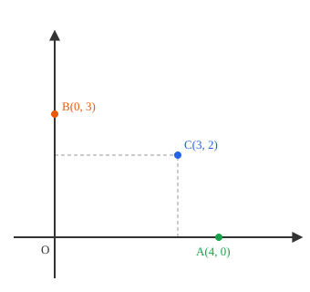
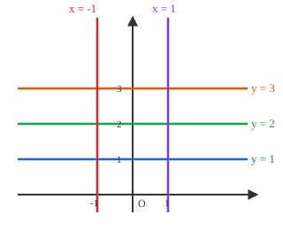
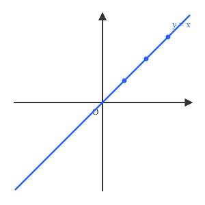
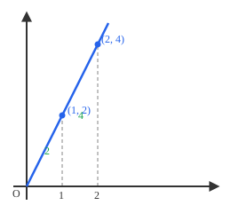
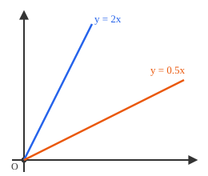
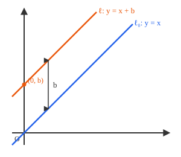

## Lecture 1: Coordinates, Points and Lines

Decartes 

### 1. Points in the Coordinate Plane
A **coordinate plane** is formed by two perpendicular number lines: a horizontal
**x-axis** and a vertical **y-axis**, meeting at the **origin** $(0, 0)$. Every
point in the plane is described by an ordered pair $(x, y)$, where $x$ is the
signed distance from the y-axis and $y$ is the signed distance from the x-axis.

**Example** The point $C(3, 2)$ is located by moving $3$ units right of the
y-axis and $2$ units up from the x-axis (the dashed guide lines above show
this).

**Example** Moving rules for a given point $(a,b)$:

* move up or down: $(a,b)\mapsto (a,b+c)$
* move right or left: $(a,b)\mapsto (a+c,b)$

### 2. Lines

This lets us turn geometric questions ("where is this point?") into algebraic
ones ("what are these two numbers?"), and it lets us turn algebraic equations
into pictures we can draw. How do we describe a line algebraically? 

#### Example 1

* vertical lines $x=a$
* horizontal lines $y=b$

Consider the horizontal lines $y = 1$,
$y = 2$, $y = 3$, and the vertical lines $x = 1$, $x = -1$:

Clearly, all horizontal lines are of the form $y=b$ and all vertical lines are of the form $x=a$.

Most lines, though, are neither horizontal nor vertical — they're slanted. That's where the concept of slope comes in. Each of these slanted lines still has some fixed **steepness**, and lines
with the same steepness never meet either, just like our horizontal (or
vertical) families above. That number is called the **slope**, and the cleanest place
to see it is on a line through the origin.

#### Definition of Slope

The slope of two points $(x_1, y_1)$ and $(x_2, y_2)$ is defined as the ratio of the difference in their $y$-coordinates to the difference in their $x$-coordinates:
$$m = \frac{y_2 - y_1}{x_2 - x_1}.$$

#### Example 3

* All horizontal lines have a slope of $0$, since there is no vertical change as you move along the line.
* All vertical lines have an infinite slope.
* The slope of a line through the origin $(0,0)$ and a point $(x, y)$ is given by
$$m = \frac{y - 0}{x - 0} = \frac{y}{x}.$$  

**Proposition:** The slope between two points on the line is a constant number. 

**Proof:** via similar triangle by picture below.

Geometrically, the slope represents the "steepness" of the line: how much the line rises or falls as you move horizontally.

For 

#### Example 2. Lines Through the Origin: $y = ax$
**The simplest example. y=x** The line through $(0,0)$ and $(1,1)$ also passes
through $(2,2)$, $(3,3)$, and in general every point $(x, x)$: its equation is
$y = x$.

**A general line through the origin.** Now take *any* line through $(0,0)$
that is not the y-axis, and mark one point on it, say $(1, 2)$, and another,
say $(2, 4)$.

For any point $(x, y)$ on this line, the triangle formed by $(0,0)$, $(x, 0)$,
and $(x,y)$ is similar to the triangle formed by $(0,0)$, $(1,0)$, and
$(1,2)$, since both are right triangles sharing the same angle at the origin.
Similar triangles have proportional sides, so
$$\frac{y}{x} = \frac{2}{1} = 2.$$

This ratio $\frac{y}{x}$ is the same **no matter which point on the line we
pick** (as long as $x \neq 0$), because *every* such triangle is similar to
every other one along the same line — that's exactly why the point $(2,4)$
above sits on the same line as $(1,2)$. We call this constant ratio the
**slope** of the line, usually written $a$. This gives us
$$y = ax.$$

So every line through the origin (other than the vertical line $x = 0$) has
the form $y = ax$ for some constant $a$. The constant $a$ tells us how steep
the line is: larger $|a|$ means a steeper line, and the sign of $a$ tells us
whether the line rises or falls as $x$ increases.

**Back to parallel lines.** Now suppose we have two different lines through
the origin, $y = a_1 x$ and $y = a_2 x$. If a point $(x, y)$ with $x \neq 0$
lies on both lines, then
$$a_1 x = y = a_2 x \implies a_1 = a_2.$$

So as long as $a_1 \neq a_2$, the two lines meet **only** at the origin — they
point in different directions. Two lines through the origin with the *same*
slope $a_1 = a_2$ are actually the same line, not two parallel lines just
touching at one point.

> 

This tells us something important: **the slope $a$ completely determines the
direction of a line.** Two lines are parallel (never meet, or are identical)
precisely when they have the same slope — this is just like our horizontal
lines $y=1,2,3$ (all "slope $0$") and vertical lines $x=1,-1$ (no slope) from
earlier, except now it works for every slanted direction too. This is the
key fact we will use next: if we want to describe a line that does *not*
pass through the origin, we should look for a line through the origin
**parallel to it**, since that parallel line shares the same slope.

### 4. Vertical Shift: from $y = ax$ to $y = ax + b$
Take any line $\ell$ that does not pass through the origin. Let $\ell_0$ be
the line through the origin parallel to $\ell$ (so $\ell_0$ has the same
slope $a$ as $\ell$, by the previous section). Since $\ell$ and $\ell_0$ are
parallel but different, $\ell$ is simply $\ell_0$ **shifted vertically** by
some fixed amount $b$: every point $(x, ax)$ on $\ell_0$ moves to
$(x, ax + b)$ on $\ell$.

> 

Why must the shift $b$ be the *same* for every point, rather than changing as
$x$ changes? Because if the vertical shift were different at different
values of $x$, the shape of $\ell$ would bend away from $\ell_0$ and the two
lines would no longer stay parallel (their slope would change from point to
point). Since we assumed $\ell$ is a straight line with the same slope
everywhere, the shift $b$ must be constant.

Note $b$ is exactly the value of $y$ when $x = 0$, i.e., where $\ell$ crosses
the y-axis. We call $b$ the **y-intercept**.

### 5. Why Every Line Has the Form $y = ax + b$
Putting the last two sections together:

* Every line through the origin has the form $y = ax$, where $a$ is the
  common slope shared by all parallel lines pointing in that same direction.
* Every other line is a vertical shift of some line through the origin, by a
  constant amount $b$ equal to its y-intercept.

Combining these, **every non-vertical line in the coordinate plane can be
written as**
$$y = ax + b,$$
where $a$ is the slope (shared by every line parallel to it) and $b$ is the
y-intercept (where the line crosses the y-axis). The only lines this misses
are vertical lines $x = c$, which have no well-defined slope since $x$ never
changes.

**Example** The line through $(0, 3)$ parallel to $y = 2x$ must have the
same slope $a = 2$, and its y-intercept is $b = 3$, so its equation is
$$y = 2x + 3.$$
