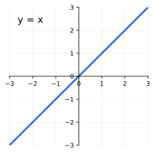
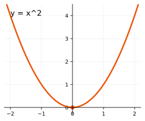
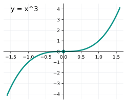
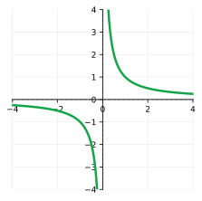
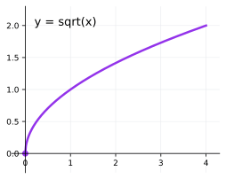
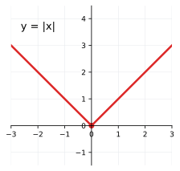
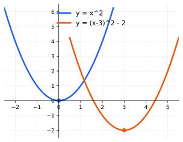
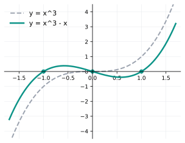
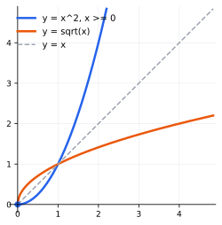
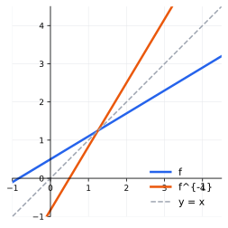

## Lecture 2: Functions, Parent Graphs, and Inverses

A function assigns exactly one output to each allowed input. Precalculus
studies a handful of basic function families and the operations —
transformation, composition, and inversion — that connect them. Once the
parent graphs are known, most other graphs are just shifted, scaled, or
reflected versions of them.

### 1. Functions, Parent Graphs, and Symmetry

**Definition.** A **function** $f$ assigns to each input $x$ in its
**domain** exactly one output $f(x)$; the **range** is the set of outputs
produced. The graph of $f$ is the set of points $(x,f(x))$.

**Vertical line test.** A graph represents a function of $x$ if and only if
every vertical line meets it at most once.

**Example (the unit circle is not a function).** The circle $x^2+y^2=1$
fails the vertical line test: for $-1<x<1$ it contains both
$y=\sqrt{1-x^2}$ and $y=-\sqrt{1-x^2}$. Solving for $y$ splits the circle
into two functions of $x$, the upper and lower semicircles.

**Example (a dropped object).** If an object is dropped from height $H$ at
time $t=0$, its height in meters is $h(t)=H-4.9t^2$, ignoring air
resistance. Until it reaches the ground,
$0\le t\le\sqrt{H/4.9}$, each time determines exactly one height, so $h$
is a function of time. Its graph is the descending part of a parabola.

Six basic functions are worth knowing by their domain, range, and graph.

| Function | Domain | Range | Graph |
|---|---|---|---|
| $y=x$ | $(-\infty,\infty)$ | $(-\infty,\infty)$ | {width=150px} |
| $y=x^2$ | $(-\infty,\infty)$ | $[0,\infty)$ | {width=150px} |
| $y=x^3$ | $(-\infty,\infty)$ | $(-\infty,\infty)$ | {width=150px} |
| $y=1/x$ | $x\neq0$ | $y\neq0$ | {width=150px} |
| $y=\sqrt{x}$ | $[0,\infty)$ | $[0,\infty)$ | {width=150px} |
| $y=\lvert x\rvert$ | $(-\infty,\infty)$ | $[0,\infty)$ | {width=150px} |

**Definition.** $f$ is **even** if $f(-x)=f(x)$ for every $x$ in its domain
(graph symmetric about the $y$-axis); $f$ is **odd** if $f(-x)=-f(x)$ (graph
symmetric about the origin).

**Example.** Of the six parent functions, $y=x^2$ and $y=|x|$ are even;
$y=x$, $y=x^3$, and $y=1/x$ are odd; $y=\sqrt{x}$ is neither, since its
domain is not symmetric about $0$.

**Exercise 1.** Find the domain and range of
$f(x)=\dfrac{\sqrt{x-1}}{x-3}$.

**Exercise 2.** True or false, with a reason:

* the range of $y=x^2$ is all real numbers
* the graph of $y=1/x$ crosses the $y$-axis
* $y=\sqrt{x}$ is the top half of $y=x^2$ turned on its side
* $y=x^3$ has domain restricted to $x\ge0$
* $|x|$ and $x^2$ have the same range

**Exercise 3.** Decide whether each is a function of $x$, and whether it is
even, odd, or neither:

* $y=3x-2$
* $x=y^2+1$
* $y=x^4$
* $y=x^3+x^2$

**Exercise 4 (harder).** Find the domain and range of
$g(x)=\dfrac{1}{\sqrt{x^2-4}}$.

### 2. Transformations and Polynomial Families

Suppose $(a,b)$ lies on $y=f(x)$.

| New function | Point on new graph | Effect |
|---|---|---|
| $f(x)+k$ | $(a,b+k)$ | shift up $k$ |
| $f(x-h)$ | $(a+h,b)$ | shift right $h$ |
| $-f(x)$ | $(a,-b)$ | reflect across $x$-axis |
| $f(-x)$ | $(-a,b)$ | reflect across $y$-axis |
| $af(x)$ | $(a,ab)$ | vertical scale by $a$ |

**Exercise 5.** Describe the transformations from the parent function in
each, then sketch the resulting graph:

* $y=-3|x+2|+1$
* $y=\sqrt{x-4}-2$
* $y=\dfrac{2}{x+1}+3$

**Exercise 6.** If $(2,-1)$ is on the graph of $f$, find the corresponding
point on $y=f(x)+4$, on $y=f(x-3)$, and on $y=-f(-x)$.

**Linear functions.** Applying the table to $y=x$ gives $y=ax+b$: a vertical
scale by $a$ (the slope) followed by a shift of $b$ (the intercept). For
$(x_1,y_1)$ and $(x_2,y_2)$, $a=\dfrac{y_2-y_1}{x_2-x_1}$.

**Exercise 7.** Find the line through $(-1,4)$ and $(3,-8)$.

**Quadratic functions.** Applying the table to $y=x^2$ gives
$y=a(x-h)^2+k$: shift right $h$, scale vertically by $a$, shift up $k$. The
vertex is $(h,k)$. Completing the square converts standard form to vertex
form:
$$
x^2+bx+c=\left(x+\tfrac b2\right)^2+c-\tfrac{b^2}{4}.
$$

**Example.** $2x^2-8x+3=2(x-2)^2-5$, vertex $(2,-5)$.

{width=300px}

**Exercise 8.** Sketch $y=-2(x+1)^2+3$, then state its vertex, axis,
opening direction, and range.

**Exercise 9.** Rewrite $y=3x^2-12x+7$ in vertex form.

**Cubic functions.** Applying the table to $y=x^3$ gives $y=a(x-h)^3+k$, a
shift of the inflection point to $(h,k)$. Since $x^3$ is strictly
increasing, $a(x-h)^3+k$ is strictly increasing when $a>0$ and strictly
decreasing when $a<0$; either way it has **no turning points**.

Not every cubic has this form. The cubic $y=x^3-x=x(x-1)(x+1)$ has three
real zeros, $-1$, $0$, and $1$; between consecutive zeros the graph must
turn around, so it has two turning points. No shift or scale of $y=x^3$ can
produce this shape.

{width=300px}

**Exercise 10.** Is $y=(x+1)^3-4$ a transformation of $y=x^3$? Is
$y=x^3-3x$? Explain.

**Polynomials in general.** A polynomial $p(x)=a_nx^n+\cdots+a_0$ has end
behavior determined by its degree and leading coefficient; its real zeros
are where the graph meets the $x$-axis, and a zero of even (odd)
multiplicity touches (crosses) the axis there.

**Exercise 11.** Sketch $p(x)=-(x-2)^2(x+1)$. List its zeros with
multiplicity, state the end behavior, and say which zero is crossed and
which is touched.

**Exercise 12 (harder).** Find a polynomial of least degree with negative
leading coefficient, a zero at $-2$ of multiplicity $2$ and a zero at $1$ of
multiplicity $1$, whose graph rises on the far left. Give its factored form
and its degree.

### 3. Composite Functions

**Definition.** The **composite function** $f\circ g$ applies $g$ first and
then $f$:
$$
(f\circ g)(x)=f(g(x)).
$$
Its domain consists of the inputs in the domain of $g$ for which $g(x)$ is
in the domain of $f$. In general, $f\circ g\ne g\circ f$.

**Example.** Let $f(x)=\sqrt{x}$ and $g(x)=3-x$. Then
$(f\circ g)(x)=\sqrt{3-x}$, with domain $(-\infty,3]$, whereas
$(g\circ f)(x)=3-\sqrt{x}$, with domain $[0,\infty)$. The order changes
both the formula and the allowed inputs.

**Exercise 13.** Let $f(x)=x^2+1$ and $g(x)=2x-3$. Find
$(f\circ g)(x)$ and $(g\circ f)(x)$.

**Exercise 14.** Let $f(x)=\sqrt{x}$ and $g(x)=x^2-4$. Find the formula and
domain of $(f\circ g)(x)$ and $(g\circ f)(x)$.

### 4. Increasing, Decreasing, and Extrema

**Definition.** $f$ is **increasing** on an interval if $x_1<x_2$ in that
interval always gives $f(x_1)<f(x_2)$; $f$ is **decreasing** if it always
gives $f(x_1)>f(x_2)$. A function that is increasing (or decreasing) on its
entire domain is automatically one-to-one, since it never repeats an
output — the key fact behind the next section.

A point where $f$ changes from increasing to decreasing is a **local
maximum**; a change from decreasing to increasing is a **local minimum**. A
**global** (or absolute) maximum or minimum is the largest or smallest value
of $f$ over its whole domain.

**Example.** Reading off the parent graphs:

* $y=x$ is increasing everywhere, with no extrema.
* $y=x^2$ is decreasing on $(-\infty,0]$ and increasing on $[0,\infty)$, with
 a global minimum $0$ at $x=0$.
* $y=x^3$ is increasing everywhere, with no extrema.
* $y=1/x$ is decreasing on $(-\infty,0)$ and decreasing on $(0,\infty)$ —
 but, as Exercise 17 shows, it is *not* decreasing on its full domain.
* $y=\sqrt{x}$ is increasing on $[0,\infty)$, with a global minimum $0$ at
 $x=0$.
* $y=|x|$ is decreasing on $(-\infty,0]$ and increasing on $[0,\infty)$,
 with a global minimum $0$ at $x=0$.

For $y=a(x-h)^2+k$, the vertex is a global minimum if $a>0$ and a global
maximum if $a<0$; the function decreases before $x=h$ and increases after it
(or the reverse, if $a<0$).

**Exercise 15.** For $y=3(x-2)^2-5$, state the intervals of increase and
decrease and the minimum value.

**Exercise 16 (harder).** The cubic $y=x^3-3x=x(x-\sqrt3)(x+\sqrt3)$ is an
odd function with zeros at $-\sqrt3$, $0$, and $\sqrt3$. Using only the end
behavior and the zeros (no calculus): decide whether the graph is
increasing or decreasing immediately to the left of $x=-\sqrt3$ and
immediately to the right of $x=\sqrt3$; then explain why there must be a
local maximum strictly between $x=-\sqrt3$ and $x=0$, and (using the odd
symmetry of the graph) a local minimum strictly between $x=0$ and
$x=\sqrt3$.

**Exercise 17 (Challenge).** Show that $f(x)=1/x$ is decreasing on
$(0,\infty)$ and decreasing on $(-\infty,0)$, but give specific numbers
$x_1<x_2$ (with $x_1$ negative and $x_2$ positive) showing that $f$ is *not*
decreasing on its full domain.

### 5. Inverse Functions

**Definition.** $f$ has an **inverse function** $f^{-1}$ exactly when, for
every $y$ in the range of $f$, the equation $y=f(x)$ can be solved for $x$
uniquely — each output comes from exactly one input. (Graphically, this is
the **horizontal line test**; algebraically, $f$ is called
**one-to-one**.) The inverse satisfies
$$
f^{-1}(f(x))=x, \qquad f(f^{-1}(x))=x.
$$
The domain of $f^{-1}$ is the range of $f$, and vice versa. To find
$f^{-1}$: write $y=f(x)$, swap $x$ and $y$, and solve for $y$ — if the
solution is not unique, $f$ has no inverse on that domain.

**Example.** For $f(x)=3x-7$: swapping gives $x=3y-7$, so
$f^{-1}(x)=\dfrac{x+7}{3}$.

**Example (restricted domain).** For $f(x)=x^2$, the equation $y=x^2$ does
not solve uniquely for $x$ on all of $\mathbb R$: both $x=\sqrt y$ and
$x=-\sqrt y$ work when $y>0$. Restricting to $x\ge0$ makes the solution
unique, $x=\sqrt y$, so $f^{-1}(x)=\sqrt{x}$ there.

{width=260px}

**Theorem.** The graph of $f^{-1}$ is the reflection of the graph of $f$
across $y=x$.

**Proof.** If $(a,b)$ is on the graph of $f$, then $b=f(a)$, so
$a=f^{-1}(b)$ and $(b,a)$ is on the graph of $f^{-1}$. The point $(b,a)$ is
the reflection of $(a,b)$ across $y=x$. $\blacksquare$

{width=260px}

**Exercise 18.** For each, decide whether $y=f(x)$ can be solved uniquely
for $x$ on the stated domain (that is, whether $f$ is one-to-one there):

* $f(x)=2x+1$ on $\mathbb R$
* $g(x)=x^2$ on $\mathbb R$
* $g(x)=x^2$ on $[0,\infty)$

**Exercise 19.** Find the inverse of $f(x)=\dfrac{x-1}{x+2}$ and state its
domain and range.

**Exercise 20 (Challenge).** Let $f$ be one-to-one and
$g(x)=af(b(x-h))+k$ with $a,b\neq0$. Find $g^{-1}$ in terms of $f^{-1}$.

**Exercise 21 (Challenge).** Prove directly from the definitions that
$(f^{-1})^{-1}=f$.

**Exercise 22 (Challenge).** Prove that if $f$ is strictly increasing on an
interval, then $f$ is one-to-one there; and if $f^{-1}$ exists, prove that
$f^{-1}$ is also strictly increasing.
