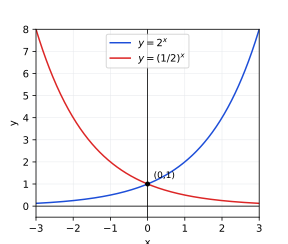
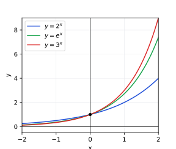
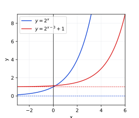

## Lecture 3: Exponential Functions

So far every function has been built from powers of $x$ with a *fixed*
exponent — $x^2$, $x^3$, $1/x$. An **exponential function** reverses the
roles: the base is fixed and the variable sits in the exponent,
$$
f(x)=b^x, \qquad b>0,\ b\neq1.
$$
Exponential functions model growth or decay whose *rate* is proportional to
the current amount — populations, radioactive decay, and compound interest
all follow this pattern — and they are the subject of this lecture.

### 1. Basic Properties: The Laws of Exponents

**The addition rule for positive integers.** Begin with $b^n$ as repeated
multiplication when $n$ is a positive integer. For positive integers $m,n$,
multiplying powers of the same base adds the exponents:
$$
b^mb^n=b^{m+n}.
$$

**Extending the rule to zero.** We want the addition rule to keep working
when one exponent is $0$. Since $b^m b^0$ must equal $b^{m+0}=b^m$, define
$$
b^0=1.
$$

**Extending the rule to negative integers.** We also want
$b^m b^{-m}=b^{m+(-m)}=b^0=1$. Thus define
$$
b^{-m}=\frac{1}{b^m}.
$$

The addition rule now holds for all integer exponents. Combining it with
$b^{-n}=1/b^n$ gives the quotient rule,
$$
\frac{b^m}{b^n}=b^m\cdot b^{-n}=b^{m+(-n)}=b^{m-n},
$$
and repeated multiplication gives the power-of-a-power and
power-of-a-product rules for integer $n$,
$$
(b^m)^n=b^{mn}, \qquad (bc)^n=b^nc^n.
$$

The restriction $b>0$ will matter when we extend exponents beyond the
integers: it ensures roots such as $b^{1/2}$ are real and positive.

**Example.** Simplify $\dfrac{2^{3x}\cdot 2^{-x+1}}{4^{x}}$.

Write $4^x=(2^2)^x=2^{2x}$, then combine exponents in the numerator and
subtract:
$$
\frac{2^{3x}\cdot2^{-x+1}}{2^{2x}}
=\frac{2^{3x+(-x+1)}}{2^{2x}}
=\frac{2^{2x+1}}{2^{2x}}
=2^{2x+1-2x}=2^1=2.
$$

**Exercise 1 (routine).** Simplify each using the addition and quotient
rules:

* $2^5\cdot2^{-7}$
* $\dfrac{3^{x+2}}{3^{x-1}}$
* $\dfrac{5^{2x}\cdot5^{-3}}{5^{x-4}}$

**Exercise 2 (algebraic).** Simplify each completely:

* $\left(2^{x}\right)^{3}\cdot 2^{-2x}$
* $\left(3^{x}\right)^{2}\cdot 3^{-x+1}$
* $\dfrac{(2^{2x})^{-1}\cdot2^{x+5}}{4^{x-1}}$

**Exercise 3 (equations).** Solve for $x$ in each. (Use that $b^x=b^y$
implies $x=y$ when $b>0$, $b\neq1$.)

* $5^{2x-1}=5^{x+4}$
* $2^{3x}=2^{x+8}$
* $4^{x+1}=8^{2x-1}$ (write both sides as powers of $2$ first)

### 2. The Graph of $y=2^x$ and $y=(1/2)^x$

Section 1 only defines $b^x$ when $x$ is an integer — the addition rule
manipulates exponents, but never says what $2^{1/2}$ *is*. Before
graphing $y=2^x$ as a curve over *every* real $x$, pause on that gap.

**Question.** Using the power-of-a-power rule $(b^x)^y=b^{xy}$, what value
must $2^{1/2}$ take so that $\left(2^{1/2}\right)^2=2^{1}=2$? What value
must $2^{1/3}$ take so that $\left(2^{1/3}\right)^3=2$? Based on these,
what should $2^{p/q}$ mean, for positive integers $p,q$?

This pins down $b^x$ for every *rational* exponent $x=p/q$: it must be
$\sqrt[q]{b^p}$, the $q$-th root of $b^p$. But pinning down $b^x$ for an
*irrational* exponent — such as $2^{\sqrt2}$ — is genuinely harder: there
is no fraction $p/q$ equal to $\sqrt2$, so no finite root captures it
directly. The rigorous definition approximates $\sqrt2$ by closer and
closer rationals $p/q$ (e.g. $1,\,1.4,\,1.41,\,1.414,\ldots$) and defines
$2^{\sqrt2}$ as the number that $2^{p/q}$ approaches — a **limit**, a tool
beyond this course. For the rest of this lecture we take for granted that
$b^x$ is defined for every real $x$, and that it varies continuously — its
graph has no holes or jumps. The exponent laws above continue to hold for
rational exponents and, with this continuous extension, for all real
exponents.

**Exercise 4 (rational exponents).** Evaluate each exactly, then rewrite
any negative exponent as a reciprocal:

* $16^{3/4}$
* $27^{-2/3}$
* $81^{1/2}$

**Basic information for $y=2^x$.**

* Domain: $(-\infty,\infty)$ — every real exponent is allowed.
* Range: $(0,\infty)$ — a positive base to any real power is positive, and
 every positive value is attained.
* $y$-intercept: $2^0=1$, so the graph passes through $(0,1)$. There is no
 $x$-intercept, since $2^x=0$ has no solution.
* Horizontal asymptote: $y=0$. As $x\to-\infty$, $2^x\to0^+$ but never
 reaches $0$.
* Monotonicity: since $2>1$, $2^x$ is increasing on all of
 $(-\infty,\infty)$ — larger exponents of a base bigger than $1$ give
 larger values.

**The function $y=(1/2)^x$.** Using the laws of exponents,
$$
\left(\frac12\right)^x=\frac{1}{2^x}=2^{-x}.
$$
Replacing $x$ by $-x$ reflects a graph across the $y$-axis, so $y=(1/2)^x$
is the mirror image of $y=2^x$ across the $y$-axis. It shares the same
domain $(-\infty,\infty)$, range $(0,\infty)$, $y$-intercept $(0,1)$, and
horizontal asymptote $y=0$, but since $0<1/2<1$, it is **decreasing**: as
$x$ increases, $(1/2)^x$ shrinks toward $0$.

{width=300px}

**Example.** Compare $2^x$ and $(1/2)^x$ at $x=-2,0,3$:

| $x$ | $2^x$ | $(1/2)^x$ |
|---|---|---|
| $-2$ | $1/4$ | $4$ |
| $0$ | $1$ | $1$ |
| $3$ | $8$ | $1/8$ |

Every row confirms the mirror symmetry: swapping the sign of $x$ swaps the
two columns.

**Exercise 5 (features).** State the domain, range, $y$-intercept, and horizontal
asymptote of $y=5^x$, and say whether it is increasing or decreasing.

**Exercise 6 (comparison).** Without a calculator, decide which is larger: $3^{0.4}$ or
$3^{0.5}$? Which is larger: $(1/3)^{0.4}$ or $(1/3)^{0.5}$? Explain using
monotonicity.

**Exercise 7 (sketch).** Sketch $y=(1/3)^x$ on the same axes as $y=3^x$.
Label their common point, the horizontal asymptote, and the points with
$x=1$ and $x=-1$ on each graph.

### 3. The Number $e$ and Continuous Compounding

**A concrete case: 100% interest.** Suppose \$1 is invested at a $100\%$
annual interest rate, and it is compounded **twice** a year: every
half-year the balance is multiplied by $1+\frac12$. After one year,
$$
A=\left(1+\frac12\right)^2=1.5^2=2.25.
$$
Compounded **four** times a year, every quarter multiplies the balance by
$1+\frac14$, so after one year,
$$
A=\left(1+\frac14\right)^4=1.25^4\approx2.4414.
$$
Compounding more often increased the balance ($2.25\to2.4414\ldots$),
since interest starts earning interest sooner. Compounding $n$ times a
year gives $A=\left(1+\frac1n\right)^n$; does this keep growing without
bound as $n\to\infty$, or does it level off?

| $n$ (times per year) | $\left(1+\frac1n\right)^n$ |
|---|---|
| $2$ | $2.25$ |
| $4$ | $2.4414$ |
| $12$ (monthly) | $2.6130$ |
| $365$ (daily) | $2.7146$ |
| $10000$ | $2.7181$ |

The balance keeps growing but the growth slows dramatically, leveling off
near $2.71828\ldots$. This limiting value is called $e$:
$$
e:=\lim_{n\to\infty}\left(1+\frac1n\right)^{n}\approx2.71828\ldots,
$$
an irrational constant, already sandwiched between $2$ and $3$ in the
table above.

**Compound interest at a general positive rate.** Now let principal $P$
earn annual rate $r>0$ (not necessarily $100\%$), compounded $n$ times per year;
after $t$ years the balance is
$$
A(t)=P\left(1+\frac{r}{n}\right)^{nt}.
$$
What happens as $n\to\infty$ — interest compounded *continuously*? Set
$m=n/r$, so $n=mr$ and $r/n=1/m$; as $n\to\infty$ with $r$ fixed,
$m\to\infty$ too. Then
$$
\left(1+\frac{r}{n}\right)^{nt}
=\left(1+\frac1m\right)^{mrt}
=\left[\left(1+\frac1m\right)^{m}\right]^{rt}.
$$
The bracketed quantity is exactly the limit found above (with $m$ in place
of $n$), so it approaches $e$ as $m\to\infty$. Substituting back,
$$
\boxed{A(t)=Pe^{rt}} \qquad \text{(continuous compounding).}
$$
The $100\%$ example above is the case $r=1$, $t=1$: $A=Pe$, matching the
table's approach toward $2.71828\ldots$ as compounding gets more frequent.
The same formula $A(t)=Pe^{rt}$ also models continuous decay when $r<0$;
the limiting argument above focuses on the positive-interest case.

**Basic information for $y=e^x$.** Since $2<e<3$, the graph of $y=e^x$ sits
between $y=2^x$ and $y=3^x$ for $x>0$ (and between them the other way for
$x<0$, since all three still meet at $(0,1)$). Like every exponential with
base greater than $1$, $y=e^x$ has domain $(-\infty,\infty)$, range
$(0,\infty)$, $y$-intercept $(0,1)$, horizontal asymptote $y=0$, and is
increasing everywhere.

{width=300px}

**Example.** \$1000 is invested at $5\%$ annual interest, compounded
continuously. After $10$ years the balance is
$$
A(10)=1000\,e^{0.05\cdot10}=1000\,e^{0.5}\approx1000(1.6487)\approx\$1648.72.
$$

**Example (credit card debt — a cautionary tale).** Credit cards commonly
charge around $20\%$ annual interest, compounded *daily* — compounding
$365$ times a year is already so close to continuous compounding that
$A(t)=Pe^{0.20t}$ is a good approximation. If a \$2000 balance is never
paid down, after $1$ year it grows to
$$
A(1)=2000\,e^{0.20}\approx2000(1.2214)\approx\$2442.80,
$$
and after $5$ years,
$$
A(5)=2000\,e^{0.20\cdot5}=2000\,e^{1}\approx2000(2.71828)\approx\$5436.56,
$$
nearly *tripling* the original debt. The same exponential growth that
makes continuously compounded savings attractive makes continuously
compounded debt dangerous: interest accrues on the unpaid interest itself,
so an untouched balance grows exponentially, not linearly, the longer it
sits. **Do not carry credit card debt** — pay the statement balance in full
each month whenever you can, so no interest accrues at all.

**Exercise 8 (routine).** \$500 is invested at $4\%$ annual interest, compounded
continuously. Write the formula for $A(t)$ and find the balance after $20$
years (leave the answer in terms of $e$, then approximate using
$e^{0.8}\approx2.2255$).

**Exercise 9 (comparison).** \$1000 earns $6\%$ annual interest for $5$
years. Write the balance if it is compounded quarterly, then write the
continuous-compounding balance. Use a calculator to approximate both
amounts to the nearest cent and state which is larger.

**Exercise 10 (reasoning).** Explain, using the formula $A(t)=P(1+r/n)^{nt}$ and the
definition of $e$, why continuous compounding gives a *larger* balance than
compounding once a year, for the same $P$, $r$, and $t>0$.

### 4. Transformations of Exponential Functions

The transformation table from Lecture 2 applies to $y=b^x$ exactly as it
does to any parent graph: if $(a,c)$ lies on $y=b^x$, then

| New function | Point on new graph | Effect |
|---|---|---|
| $b^x+k$ | $(a,c+k)$ | shift up $k$ |
| $b^{x-h}$ | $(a+h,c)$ | shift right $h$ |
| $-b^x$ | $(a,-c)$ | reflect across $x$-axis |
| $b^{-x}$ | $(-a,c)$ | reflect across $y$-axis |
| $A\cdot b^x$ | $(a,Ac)$ | vertical scale by $A$ |

The most important consequence is what happens to the asymptote: since
$y=b^x$ has horizontal asymptote $y=0$, the shifted function
$y=A\cdot b^{x-h}+k$ has horizontal asymptote $y=k$ — vertical shifts move
the asymptote, but horizontal shifts, reflections, and vertical scaling do
not.

**Example.** For $y=2^{x-3}+1$: starting from $y=2^x$ (asymptote $y=0$,
through $(0,1)$), shift right $3$ and up $1$. The asymptote moves to
$y=1$, and the point $(0,1)$ moves to $(3,2)$. The $y$-intercept is
$$
2^{0-3}+1=2^{-3}+1=\frac18+1=\frac98.
$$

{width=300px}

**Exercise 11 (features).** For $y=3\cdot2^{x}-4$: state the horizontal asymptote,
the $y$-intercept, and whether the graph is increasing or decreasing.

**Exercise 12 (transformations).** For $y=-2^{x+1}+3$: describe the transformations from
$y=2^x$ in order, then state the horizontal asymptote and the point
corresponding to $(0,1)$ on the parent graph.

**Exercise 13 (sketch and explain).** Sketch $y=e^{x-2}$ and $y=e^{x}-2$ on separate axes.
Explain in one sentence why these two graphs are different, even though
both come from shifting $y=e^x$ by $2$.

**Exercise 14 (harder).** A bacteria colony is modeled by
$N(t)=500\cdot 2^{t/3}$, where $t$ is measured in hours. Show directly
that $N(t+3)=2N(t)$, then state the horizontal asymptote and explain what
it means in the context of the model. (A later logarithms lecture will
show how to rewrite this model using $e$.)

### 5. Growth and Decay Models

Applications usually state a *rate per period* rather than a base. The
**percentage-rate form** of an exponential model is
$$
P(t)=P_0(1+r)^t,
$$
where $P_0=P(0)$ is the initial amount and $r$ is the rate per period,
written as a decimal (positive for growth, negative for decay).

* If $r>0$, the base $b=1+r>1$: **exponential growth**, increasing by
 $r\times100\%$ each period.
* If $-1<r<0$, the base $b=1+r$ satisfies $0<b<1$: **exponential decay**,
 decreasing by $|r|\times100\%$ each period.

**Example (growth).** A town of $12{,}000$ grows $3\%$ per year:
$P(t)=12000(1.03)^t$, base $b=1.03=1+0.03$. After $5$ years,
$P(5)=12000(1.03)^5\approx12{,}000(1.1593)\approx13{,}910$.

**Example (decay).** A car worth \$24{,}000 depreciates $15\%$ per year.
Losing $15\%$ leaves $85\%$, so $b=1-0.15=0.85$ and
$V(t)=24000(0.85)^t$. After $4$ years,
$V(4)=24000(0.85)^4\approx24{,}000(0.5220)\approx\$12{,}533$.

**Half-life and doubling time.** Decay is often described instead by its
**half-life** $h$, the time for the quantity to fall to half its value:
$$
A(t)=A_0\left(\frac12\right)^{t/h}.
$$
Growth is likewise described by its **doubling time** $d$:
$$
P(t)=P_0\cdot2^{t/d}.
$$
Both are percentage-rate models in disguise — setting $t=h$ gives
$A(h)=A_0\cdot\frac12$, and setting $t=d$ gives $P(d)=2P_0$, matching the
name. Whenever $t$ is a whole multiple of $h$ or $d$, these evaluate
without a calculator.

**Example.** Iodine-131 has a half-life of $8$ days. Starting from
$A_0=40$ mg, after $24$ days ($=3$ half-lives),
$$
A(24)=40\left(\frac12\right)^{24/8}=40\left(\frac12\right)^3=40\cdot\frac18=5\text{ mg}.
$$

**Exercise 15 (routine).** A population of $5{,}000$ bacteria grows $8\%$ per hour.
Write $P(t)$ in percentage-rate form and find the population after $3$
hours.

**Exercise 16 (routine).** A machine worth \$8{,}000 depreciates $20\%$ per year.
Write $V(t)$ in percentage-rate form, state whether this is growth or
decay and why, and find its value after $3$ years.

**Exercise 17 (half-life).** A radioactive sample has a half-life of $6$ hours and
starts at $A_0=80$ g. Find the amount remaining after $18$ hours, without
a calculator.

**Exercise 18 (doubling time).** A culture of yeast doubles every $2$ hours, starting from
$200$ cells. Write $P(t)$ in doubling-time form, and find the population
after $8$ hours.

**Exercise 19 (model from data).** A culture has $300$ cells at $t=0$ and
$1200$ cells at $t=4$ hours. Assume $P(t)=ab^t$.

* Find $a$ and $b$.
* Write the model $P(t)$.
* Use it to predict the population after $6$ hours.

**Exercise 20 (challenge).** Show that the percentage-rate form
$P(t)=P_0(1+r)^t$ and the doubling-time form $P(t)=P_0\cdot2^{t/d}$
describe the same function exactly when $1+r=2^{1/d}$ — that is, a growth
rate $r$ per period corresponds to doubling time $d$.
