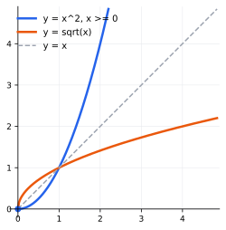
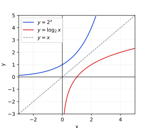
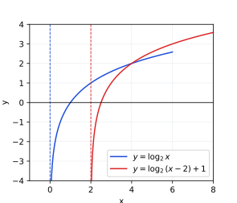
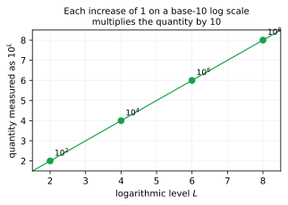

## Lecture 4: Inverse and Logarithmic Functions

An inverse function reverses a process. Addition and subtraction reverse each
other; multiplication by a nonzero number is reversed by division. The
exponential function $b^x$ also has an inverse, but the operation that
reverses “raise $b$ to a power” needs a new name: the **logarithm**. This
lecture develops inverse functions first, then uses that idea to make
logarithms useful for solving exponential equations and interpreting
real-world scales.

### 1. Inverse Functions and Their Graphs

A function $f$ has an **inverse function** $f^{-1}$ exactly when every output
of $f$ comes from one input. Such a function is called **one-to-one**. The
inverse reverses input and output:
$$
f^{-1}(f(x))=x, \qquad f(f^{-1}(y))=y.
$$

**Horizontal line test.** A function is one-to-one if and only if every
horizontal line meets its graph at most once. A repeated $y$-value would mean
two different inputs produce the same output, so an inverse could not decide
which input to return.

**Finding an inverse algebraically.** To find $f^{-1}$:

1. Write $y=f(x)$.
2. Solve the equation for $x$ in terms of $y$.
3. Swap the variable names $x$ and $y$.
4. Write the result as $f^{-1}(x)$, and state its domain if it is restricted.

**Example.** Find the inverse of $f(x)=5-2x$.

Write $y=5-2x$, then solve for $x$:
$$
2x=5-y
\quad\Longrightarrow\quad
x=\frac{5-y}{2}.
$$
Now swap the variable names. Thus
$$
\boxed{f^{-1}(x)=\frac{5-x}{2}}.
$$
Check both compositions:
$$
f^{-1}(f(x))=\frac{5-(5-2x)}2=x,
\qquad
f(f^{-1}(x))=5-2\left(\frac{5-x}{2}\right)=x.
$$

**Graphs of inverses.** If $(a,b)$ lies on the graph of $f$, then $(b,a)$
lies on the graph of $f^{-1}$. Swapping coordinates reflects a point across
the line $y=x$, so the two graphs are reflections across $y=x$. Their
domains and ranges exchange:
$$
\operatorname{dom}(f^{-1})=\operatorname{range}(f),
\qquad
\operatorname{range}(f^{-1})=\operatorname{dom}(f).
$$

**Restricted domains.** The function $f(x)=x^2$ is not one-to-one on all
real numbers because $f(2)=f(-2)=4$. Restricting its domain to $x\ge0$
makes it one-to-one. Then its inverse is
$$
f^{-1}(x)=\sqrt{x}, \qquad x\ge0.
$$
The restriction is essential: $\sqrt{x}$ returns the nonnegative square
root only.

{width=280px}

**Exercise 1 (one-to-one).** Use the horizontal line test or an algebraic
reason to decide whether each function is one-to-one on the stated domain.

* $f(x)=4x-1$ on $\mathbb R$
* $g(x)=x^2-3$ on $\mathbb R$
* $h(x)=x^2-3$ on $[0,\infty)$

**Exercise 2 (inverse).** Find the inverse of $f(x)=\dfrac{x+4}{3}$, then
verify both compositions.

**Exercise 3 (restricted inverse).** Restrict $f(x)=(x-1)^2$ to $x\ge1$.
Find $f^{-1}(x)$ and state the domain and range of both $f$ and $f^{-1}$.

### 2. Logarithms: Inverses of Exponentials

Let $b>0$ and $b\neq1$. The **logarithm of $x$ to base $b$** is the exponent
to which $b$ must be raised to obtain $x$:
$$
\boxed{\log_b x=y\quad\text{if and only if}\quad b^y=x}.
$$

This equivalence is a translation rule, not a new calculation rule. For
example,
$$
\log_2 8=3\quad\Longleftrightarrow\quad2^3=8,
$$
and
$$
\log_{10}\left(\frac1{100}\right)=-2
\quad\Longleftrightarrow\quad10^{-2}=\frac1{100}.
$$

Because $b^x>0$ for every real $x$, a logarithm accepts only positive
inputs:

* Domain of $y=\log_b x$: $(0,\infty)$.
* Range of $y=\log_b x$: $(-\infty,\infty)$.
* $x$-intercept: $(1,0)$ because $\log_b1=0$.
* Vertical asymptote: $x=0$.
* If $b>1$, $\log_bx$ is increasing; if $0<b<1$, it is decreasing.

The notation $\log x$ means $\log_{10}x$ (the **common logarithm**), and
$\ln x$ means $\log_e x$ (the **natural logarithm**). Since $\ln$ is the
inverse of $e^x$,
$$
\ln(e^x)=x, \qquad e^{\ln x}=x \quad (x>0).
$$

The functions $y=2^x$ and $y=\log_2x$ are inverses, so their graphs reflect
across $y=x$. Notice how the horizontal asymptote $y=0$ of the exponential
becomes the vertical asymptote $x=0$ of the logarithm.

{width=320px}

**Example.** Evaluate without a calculator:
$$
\log_3 81=4,\qquad \log_5\sqrt5=\frac12,
\qquad \log_2\left(\frac18\right)=-3.
$$
Each answer is an exponent: $3^4=81$, $5^{1/2}=\sqrt5$, and
$2^{-3}=1/8$.

**Exercise 4 (translation).** Rewrite each statement in the other form.

* $4^3=64$
* $10^{-4}=0.0001$
* $\log_7 49=2$
* $\ln(e^{-3})=-3$

**Exercise 5 (exact values).** Evaluate without a calculator.

* $\log_2 32$
* $\log_9 3$
* $\log_{10}(0.01)$
* $\ln1$

**Exercise 6 (features).** State the domain, range, $x$-intercept, vertical
asymptote, and monotonicity of $y=\log_{1/3}x$, then plot the graph,
labeling the asymptote.

### 3. Logarithm Rules and Equations

The logarithm rules come from the exponent rules. For positive $M,N$ and
real $r$,
$$
\boxed{\log_b(MN)=\log_bM+\log_bN},
$$
$$
\boxed{\log_b\left(\frac{M}{N}\right)=\log_bM-\log_bN},
$$
$$
\boxed{\log_b(M^r)=r\log_bM}.
$$

For example, if $u=\log_bM$ and $v=\log_bN$, then $M=b^u$ and $N=b^v$.
Thus $MN=b^ub^v=b^{u+v}$, so $\log_b(MN)=u+v$.

**Example.** Expand and simplify:
$$
\log_2\left(\frac{8x^3}{y}\right)
=\log_2 8+\log_2x^3-\log_2y
=3+3\log_2x-\log_2y,
$$
where $x>0$ and $y>0$.

**Solving exponential equations.** If both sides can be written with the
same base, use equal exponents. Otherwise, take a logarithm of both sides.
For $a>0$, $a\neq1$, and $C>0$,
$$
a^x=C
\quad\Longrightarrow\quad
\ln(a^x)=\ln C
\quad\Longrightarrow\quad
x\ln a=\ln C
\quad\Longrightarrow\quad
\boxed{x=\frac{\ln C}{\ln a}}.
$$
The last quotient is the **change-of-base formula**:
$$
\boxed{\log_bC=\frac{\ln C}{\ln b}=\frac{\log C}{\log b}}.
$$

**Exercise 7 (log rules).** Expand each expression as far as possible.
Assume all variables are positive.

* $\log_5\left(\dfrac{25x}{z^2}\right)$
* $\ln\left(\dfrac{\sqrt{x}}{3y}\right)$
* $\log_2(16a^4b)$

**Exercise 8 (exact equations).** Solve exactly.

* $3^{2x-1}=27$
* $\log_2(x-1)=4$
* $\ln(x+2)=0$

**Combining logarithms and checking for extraneous solutions.** When an
equation has more than one logarithm, use the product or quotient rule to
combine them into a single logarithm, then convert to exponential form.
Because a logarithm is defined only for a positive argument, **always
check every candidate solution in the original equation** — combining
logarithms can introduce a root that does not actually belong to the
domain.

**Example.** Solve $\log_2(x+1)+\log_2(x-1)=3$.

The original equation requires $x+1>0$ and $x-1>0$, i.e. $x>1$. Combine
the left side with the product rule, then convert to exponential form:
$$
\log_2\big[(x+1)(x-1)\big]=3
\quad\Longrightarrow\quad
\log_2(x^2-1)=3
\quad\Longrightarrow\quad
x^2-1=2^3=8
\quad\Longrightarrow\quad
x^2=9
\quad\Longrightarrow\quad
x=\pm3.
$$
Since $x=-3$ fails $x>1$, it is **extraneous** and must be rejected. Only
$$
\boxed{x=3}
$$
solves the original equation. (Check: $\log_2 4+\log_2 2=2+1=3$.)

**Exercise 9 (extraneous solutions).** Solve each equation, then check
every candidate solution against the domain of the original logarithms
and discard any extraneous root.

* $\log_3(x+2)+\log_3x=1$
* $\log(x)+\log(x-3)=1$

**Exercise 10 (calculator equations).** Use a calculator and round each
answer to three decimal places.

* $2^x=7$
* $5e^{0.4t}=60$
* $\log_3(x+1)=2.7$

### 4. Transformations of Logarithmic Functions

The same transformation rules used for exponentials apply to logarithms.
For $y=A\log_b(x-h)+k$, the parent graph $y=\log_bx$ is shifted right $h$,
shifted up $k$, vertically scaled by $A$, and reflected across the $x$-axis
when $A<0$.

The domain and vertical asymptote move together:
$$
x-h>0\quad\Longrightarrow\quad x>h,
\qquad\text{vertical asymptote }x=h.
$$
The vertical shift $k$ does **not** move the vertical asymptote.

**Example.** For $y=\log_2(x-2)+1$, start with $y=\log_2x$, shift right $2$,
then up $1$. The vertical asymptote shifts from $x=0$ to $x=2$, the domain
is $(2,\infty)$, and the parent point $(1,0)$ moves to $(3,1)$.

{width=320px}

**Reflected logarithms.** Replacing $x$ by $-x$ reflects the graph across
the $y$-axis: $y=\log_b(-x)$ has domain $x<0$, with the same vertical
asymptote $x=0$. More generally, $y=\log_b(h-x)$ has domain $x<h$ and
vertical asymptote $x=h$ — the mirror image of $y=\log_b(x-h)$.

**Exercise 11 (features).** For $y=-2\log_3(x+1)+4$, describe the
transformations from $y=\log_3x$, then state the domain, vertical asymptote,
and the point corresponding to $(1,0)$.

**Exercise 12 (sketch).** Sketch $y=\ln(x-3)$, labeling its vertical
asymptote and two points obtained from $y=\ln x$.

**Exercise 13 (challenge).** Explain why $y=\log_2(x^2)$ is not the same
function as $y=2\log_2x$. State the domain of each function and identify
where their formulas agree.

### 5. Logarithms in Real Life

Logarithms make an enormous range manageable by recording an exponent
instead of the raw quantity. An increase of $1$ on a base-$10$ log scale
means the original quantity is multiplied by $10$.

{width=340px}

**pH.** The pH of a solution is defined by
$$
\mathrm{pH}=-\log_{10}[\mathrm{H}^+],
$$
where $[\mathrm{H}^+]$ is the hydrogen-ion concentration in moles per liter.
A solution with $[\mathrm{H}^+]=10^{-3}$ has pH $3$, while one with
$[\mathrm{H}^+]=10^{-5}$ has pH $5$. The latter has $100$ times *less*
hydrogen-ion concentration, even though its pH is only $2$ units higher.

**Sound intensity level.** The decibel level of sound intensity $I$ relative
to a reference intensity $I_0$ is
$$
L=10\log_{10}\left(\frac{I}{I_0}\right).
$$
Thus a $10$-decibel increase multiplies intensity by $10$, while a
$20$-decibel increase multiplies intensity by $100$. Perceived loudness is
more complicated, but the intensity calculation follows this logarithmic
rule.

**Earthquake magnitude.** The Richter magnitude of an earthquake with
seismic wave amplitude $A$, relative to a reference amplitude $A_0$, is
$$
M=\log_{10}\left(\frac{A}{A_0}\right).
$$
Each whole-number increase in magnitude corresponds to a $10$-fold
increase in wave amplitude: a magnitude-$7$ earthquake has $10$ times the
amplitude of a magnitude-$6$ earthquake, and $100$ times the amplitude of
a magnitude-$5$ earthquake.

**Solving for time in a growth model.** A savings account with continuous
compounding follows $A(t)=Pe^{rt}$. If the target balance $A$ is known,
logarithms isolate the unknown time:
$$
A=Pe^{rt}
\quad\Longrightarrow\quad
\frac{A}{P}=e^{rt}
\quad\Longrightarrow\quad
\ln\left(\frac{A}{P}\right)=rt
\quad\Longrightarrow\quad
\boxed{t=\frac{\ln(A/P)}{r}}.
$$

**Example (calculator).** How long does it take \$2000 invested at $6\%$
annual interest, compounded continuously, to grow to \$3000?
$$
t=\frac{\ln(3000/2000)}{0.06}=\frac{\ln(1.5)}{0.06}\approx6.758.
$$
It takes about $6.76$ years.

**Exercise 14 (pH).** A solution has $[\mathrm{H}^+]=10^{-6.2}$. Find its
pH. How many times greater is its hydrogen-ion concentration than a
solution with pH $8.2$?

**Exercise 15 (decibels).** A sound changes from $50$ dB to $80$ dB. By
what factor does its intensity change? Explain using the formula for $L$.

**Exercise 16 (calculator application).** A \$5000 investment earns $5\%$
annual interest compounded continuously. Use logarithms to find how long it
takes to reach \$8000. Round to two decimal places.

**Exercise 17 (modeling, calculator).** A bacteria culture follows
$P(t)=300\cdot2^{t/4}$, where $t$ is measured in hours. Use logarithms to
find when the population first reaches $5000$. Give an exact logarithmic
expression and a calculator approximation in hours.

**Exercise 18 (challenge).** Let $f(x)=a^x$ for $a>0$, $a\neq1$. Prove
that $f^{-1}(x)=\log_ax$ directly by checking both compositions, including
the necessary domain restrictions.
